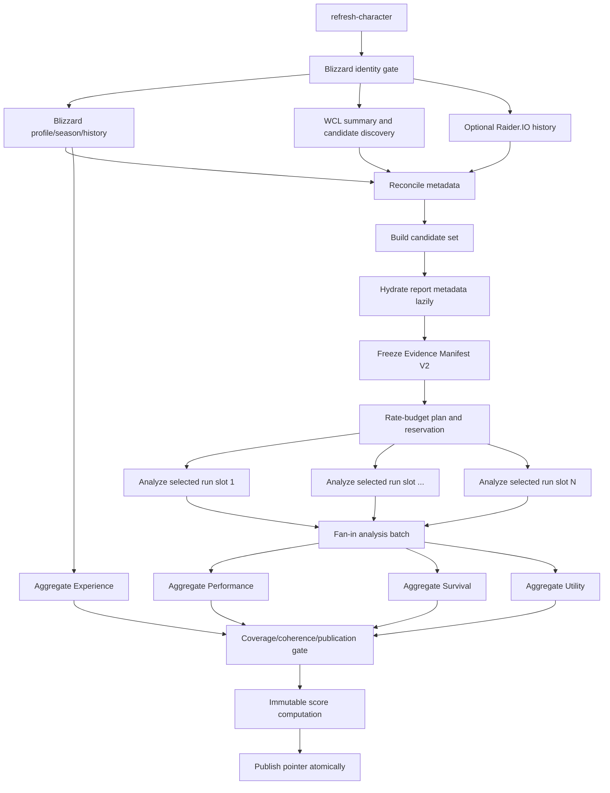

# Pipeline orchestration and parallelism

## 1. Target DAG



## 2. Queue topology

Recommended queues:

- `refresh-character`: orchestrator, identity, discovery, manifest.
- `analyze-evidence-slot`: one job per selected slot.
- `finalize-analysis-batch`: fan-in and dimension aggregation.
- `recalculate-score`: provider-free replay from existing fact sets.
- `calibration-run`: isolated provider-free backtests.
- existing addon/export and bulk queues remain separate.

The current generic `analyze-run` may be evolved or replaced. Queue names and payload schemas must be versioned.

## 3. Job payloads

### Evidence slot analysis

```ts
interface AnalyzeEvidenceSlotJobV2 {
  analysisBatchId: string;
  manifestId: string;
  slotId: string;
  expectedManifestHash: string;
  expectedReportRevision: number;
  enabledConsumers: Array<"PERFORMANCE" | "SURVIVAL" | "UTILITY">;
  requestedAt: string;
  correlationId: string;
}
```

The job contains IDs and expected hashes, not large payloads.

### Finalization

```ts
interface FinalizeEvidenceBatchJobV2 {
  analysisBatchId: string;
  expectedManifestHash: string;
  expectedTerminalSlotCount: number;
  requestedAt: string;
}
```

## 4. Idempotency

Every job has a deterministic dedupe key.

```text
refresh: character + season + refresh contract + force generation
slot: manifest hash + slot ID + fact extractor set
finalize: batch ID + manifest hash + score model ID
calibration: frozen input bundle hash + mode + model refs + seed
```

Rules:

- terminal redelivery is a no-op;
- claims use transactional compare-and-set;
- writes use unique compatibility keys;
- artifact writes are content-addressed;
- publication pointer updates are transactional;
- cancellation and admission release are idempotent.

## 5. Parallelism

### Provider discovery

Blizzard enrichment, WCL summary, and optional Raider.IO may run concurrently after Blizzard identity bootstrap. Blizzard identity itself remains the gate.

### Selected-run analysis

Selected slots may run concurrently, bounded by:

- global WCL point budget;
- WCL request concurrency;
- database connection budget;
- worker memory;
- per-character fairness.

The number of queue jobs may be 16, but provider calls inside them remain controlled globally.

### Dimension aggregation

Once fact sets are terminal, Performance, Survival, Utility, and Experience aggregation are pure/provider-free and can run concurrently.

## 6. Fairness and priorities

A single character with 16 slots must not monopolize all WCL capacity.

Use:

- per-character max active slot jobs;
- round-robin or weighted fairness across manifests;
- user-triggered versus bulk priority;
- calibration queue isolated from refresh queues;
- no priority feature activation without queue-level tests.

## 7. Analysis batch states

```text
PLANNING
MANIFEST_READY
ADMISSION_DEFERRED
FETCHING
ANALYZING
READY_TO_FINALIZE
FINALIZING
FINALIZED
FAILED
CANCELLED
EXPIRED
```

Per-slot states:

```text
PENDING
RUNNING
SUCCEEDED
PARTIAL
UNAVAILABLE
FAILED
CANCELLED
SUPERSEDED
```

A batch becomes finalizable only when all expected slots are terminal.

## 8. Cancellation

Cancellation checks occur:

- before provider calls;
- between pages;
- before artifact/fact persistence;
- before finalization;
- before publication.

Cancellation preserves reusable completed artifacts. It prevents a new public pointer update.

## 9. Error classification

- **Retryable**: network timeout, transient 5xx, 429 after reset, temporary Redis issue.
- **Fallbackable**: archived/gated report, missing actor, invalid selected candidate before manifest freeze.
- **Terminal unavailable**: hidden character, no public logs, unsupported scope.
- **Terminal bug/schema**: invalid adapter shape, invariant violation.
- **Deferred**: insufficient rate budget.
- **Cancelled/superseded**: user/admin action or newer refresh generation.

Generic BullMQ retries must not blindly repeat non-retryable WCL work.

## 10. Transaction boundaries

- Candidate persistence can be incremental.
- Manifest freeze is one transaction.
- Slot status claim is one transaction.
- Fact-set write and slot success transition are one transaction where feasible.
- Dimension aggregate and score computation are written atomically.
- Public pointer update occurs only after all publication gates pass.

External provider calls MUST NOT occur inside database transactions.

## 11. Pure replay path

`recalculate-score` and calibration load:

- frozen manifest;
- fact-set versions;
- metric inputs;
- model configuration.

They MUST fail if required evidence/version is unavailable. They MUST NOT call Blizzard, WCL, or Raider.IO.

## 12. Current architecture adaptation

The current refresh pipeline executes most stages synchronously and can execute analysis inline. Migration steps:

1. introduce V2 records in shadow while retaining V1 execution;
2. enqueue slot jobs behind a flag;
3. compare output and cost;
4. move finalization to fan-in;
5. remove inline detailed analysis after cutover;
6. retain provider-free recalculate path.

## 13. Required tests

- 16-slot fan-out and deterministic fan-in;
- partial provider failures;
- redelivery at every state;
- concurrent finalizers;
- cancellation mid-pagination;
- superseding refresh generation;
- fairness across characters;
- queue isolation from calibration;
- no provider call in finalizer/recalculate/calibration;
- public pointer unchanged on incomplete batch;
- graceful shutdown with active slot jobs.
