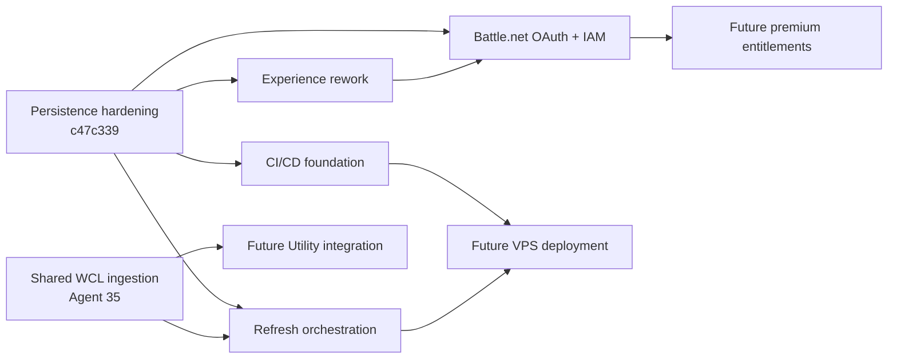

# Wave 4.3 Program Brief

## Purpose

Wave 4.3 moves M+ Trust Factor from a scoring prototype toward a production-ready public service.

The wave focuses on four foundations:

- a defensible Experience dimension;
- authenticated user and character ownership;
- sustainable automatic refreshes;
- reliable deployment and operations.

## Dependency map

## Workstream boundaries

### Experience

May change Experience scoring logic, observations, sources, persistence, explanations and tests. Must not change global weights, Utility, OAuth/IAM or billing.

### Battle.net OAuth and IAM

May change users, sessions, identities, roles, permissions, account linking, verified ownership and premium-ready entitlements. Must not silently alter Experience semantics, implement payments or expose alt relationships publicly.

### Refresh orchestration

May change cohort selection, scheduling, budget planning, queue policies, prioritization and observability. Must not change scoring curves or weaken last-known-good publication.

### CI/CD

May change workflows, Docker packaging, migrations, health checks, backup and rollback. Must not change business logic or scoring.

## Merge gates

A branch is mergeable only when:

- the full monorepo build passes;
- relevant tests pass;
- migrations apply to an existing populated database;
- no published score is lost;
- public reads remain provider-free;
- secrets are not committed;
- the agent provides a commit hash and changed-file summary.
