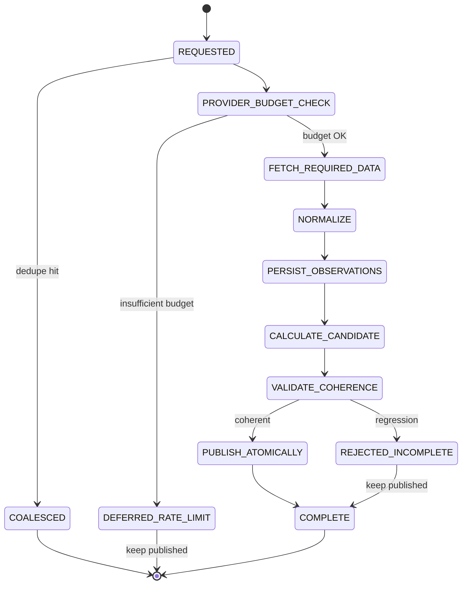

# Persistence & Refresh Hardening — Architecture Audit

## Executive summary

The scoring system follows a **refresh pipeline** (BullMQ worker) that fetches provider data, fuses runs, extracts observations, calculates a `ScoreSnapshot`, and publishes it. PostgreSQL is the durable source of truth; Redis is used only for BullMQ queues.

**Root causes of score disappearance** (concrete paths):

| Symptom | Root cause | File / function |
|---------|-----------|-----------------|
| Performance/Survival disappear | `replaceObservations` delete-first wipes all observations before score save | `metric-repository.replaceObservations` |
| Survival lost on WCL combat failure | Pipeline forces PERFORMANCE `UNAVAILABLE` when `wclPerformance.observations.length === 0` even if persisted data exists | `refresh-pipeline.ts` ~L2047–2056 |
| Coherent score → UNRANKED | Grade `U` when `modelCoverageRatio < 0.5` after partial WCL skip | `packages/scoring/src/model-coverage.ts` |
| Partial refresh overwrites complete | `saveScoreSnapshot(publish: true)` supersedes without coherence gate | `score-repository.saveScoreSnapshot` |
| Dimensions null after refresh | Score calculated from empty/partial observations post-delete | `refresh-pipeline` extract-metrics → calculate-score |

---

## 1. ScoreSnapshot schema and lifecycle

**Schema:** `packages/database/prisma/schema.prisma` — `score_snapshots`, `dimension_scores`, `character_published_scores`

**Lifecycle (before hardening):**
1. Pipeline calculates → `saveScoreSnapshot({ publish: true })`
2. Prior `isPublic: true` rows → `SUPERSEDED`
3. API reads via `getLatestSnapshot` (`isPublic: true`, `calculatedAt DESC`)

**Lifecycle (after hardening):**
1. Pipeline calculates **candidate** → coherence validation
2. Pass → `PUBLISHED` + `character_published_scores` pointer update (atomic)
3. Fail → `REJECTED_INCOMPLETE` (diagnostic only); published pointer unchanged
4. API reads via `getPublishedSnapshot` (pointer-first, fallback `isPublic`)

---

## 2. Observation persistence

| File | Behavior |
|------|----------|
| `apps/worker/src/persistence/metric-repository.ts` | `upsertObservations` by `observationKey`; `replaceObservations` retained for legacy |
| `packages/scoring/src/publication/coherence.ts` | `mergeObservationsWithLastKnownGood`, `buildObservationKey` |

**Unique key:** `(characterId, seasonId, observationKey)` where key = `metricKey|provider|report|fight|analysisVersion|fingerprint`

---

## 3. RunAnalysis persistence

| File | Role |
|------|------|
| `apps/worker/src/persistence/run-repository.ts` | `upsertRunAnalysis`, `findRunAnalysis` |
| `apps/worker/src/orchestration/analyze-run.ts` | Standalone queue processor |

Survival analyses reused when `isCompatibleSurvivalSummary` && `!forceRefresh`.

---

## 4. Provider response caching

| Layer | Location |
|-------|----------|
| In-process TTL | `packages/providers/blizzard/src/cache.ts`, `raiderio/src/cache.ts` |
| Durable DB | `external_requests` + `external_payloads` |
| WCL revision | `packages/providers/warcraftlogs/src/analysis/revision-cache.ts` |

Recording: `apps/worker/src/orchestration/provider-recording.ts`

---

## 5. Refresh jobs and coalescing

| File | Mechanism |
|------|-----------|
| `apps/worker/src/persistence/job-repository.ts` | `resolveForEnqueue`, `dedupeKey` unique |
| `apps/worker/src/dedupe.ts` | `refreshCharacterDedupeKey` includes `refreshContractHash` |

Concurrent refreshes for same character/contract → one active `IngestionJob`.

---

## 6. Refresh pipeline orchestration

**Central DAG:** `apps/worker/src/orchestration/refresh-pipeline.ts`

**New phases:** `apps/worker/src/orchestration/refresh-phases.ts`

**Publication gate:** `apps/worker/src/orchestration/publication-flow.ts`

---

## 7. Public read path

| Route | External calls |
|-------|----------------|
| `GET /characters/:region/:realm/:name` | **Zero** — DB only; may enqueue async refresh |
| `POST /refresh` | Zero — enqueue only |
| `POST /resolve` (new char) | Blizzard verify only |

`character-service.ts` uses `getPublishedSnapshot`.

---

## 8. WCL rate budget

**Manager:** `apps/worker/src/orchestration/wcl-budget-manager.ts`

- Preflight once per batch
- `DEFERRED_RATE_LIMIT` when `pointsRemaining < cost + reserve`
- Circuit breaker after 5 consecutive failures

---

## 9. Dataset-specific freshness

**Config:** `packages/config/src/freshness.ts`

Immutable WCL report/combat data: 30-day TTL. Profile/rankings: env TTLs.

---

## 10. Daily cohort feasibility matrix

See `apps/worker/src/orchestration/cohort-selector.ts` — `COHORT_FEASIBILITY_MATRIX`.

| Strategy | Feasible without full population scan |
|----------|--------------------------------------|
| TRACKED_PERCENTILE | Yes — denominator = tracked characters with published score |
| RATING_THRESHOLD | Yes |
| RECENTLY_VIEWED | Yes (requires view instrumentation) |
| DAILY_ELITE_COHORT | Yes — composite of rating + activity + stale TTL |

---

## 11. Redis strategy

Redis = BullMQ only. Correctness does not depend on Redis. API `ResponseCache` is in-process; loss falls back to PostgreSQL.

---

## 12. Refresh state machine

---

## 13. Migration plan

**Migration:** `20260729120000_persistence_refresh_hardening`

1. Add enum values: `CANDIDATE`, `PUBLISHED`, `REJECTED_INCOMPLETE`
2. Add snapshot metadata columns
3. Add `observation_key` + partial unique index
4. Create `character_published_scores`
5. Backfill: `PUBLIC` → `PUBLISHED`, create pointers from latest public snapshots

**Deployment order:** migrate → generate client → deploy worker → deploy API (rolling safe).

---

## 14. Security

- Force refresh: admin bypass + `MANUAL_REFRESH_COOLDOWN_SECONDS` for non-admin
- No provider secrets in API responses
- Input normalization via `normalizeRegion`, `normalizeRealmSlug`

---

## 15. Observability

Structured log events: `refresh_publication_rejected`, `refreshScoreCalculated`, `refreshTerminal` with `publicationRejected`, `violations`, `regressedDimensions`.

---

## Files changed (summary)

| Area | Files |
|------|-------|
| Schema | `schema.prisma`, migration SQL |
| Publication | `coherence.ts`, `publication-flow.ts`, `score-repository.ts` |
| Observations | `metric-repository.ts` |
| Pipeline | `refresh-pipeline.ts` |
| Budget/cohort | `wcl-budget-manager.ts`, `cohort-selector.ts`, `refresh-phases.ts` |
| Freshness | `packages/config/src/freshness.ts` |
| API | `character-service.ts` |
| Tests | `*.hardening.test.ts`, `coherence.test.ts`, `publication-flow.wallidrixe.test.ts` |
