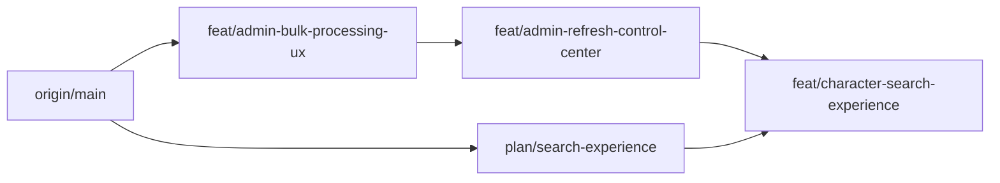
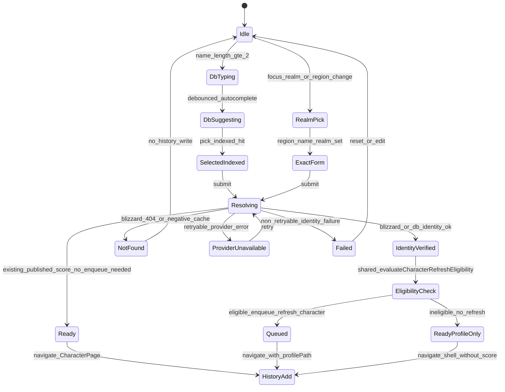

# Character research / search experience — architecture plan

**Status:** implementation-ready plan (documentation only)  
**Branch:** `plan/search-experience`  
**Audience:** implementers of the public Research / character search UX  
**Non-goals for this commit:** production code, contracts, migrations, shared search Vue components

This artifact lives under [`docs/`](../README.md) (plan/audit space). Canonical product docs remain under [`doc/`](../../doc/README.md).

---

## 1. Product scenarios

| Scenario | Meaning | Primary path |
|----------|---------|--------------|
| **A — Persisted** | Character already exists in the platform database | Debounced DB autocomplete → optional select → `POST /api/v1/characters/resolve` → CharacterPage |
| **B — External** | Character not yet persisted | Exact Region + Name + Realm (catalog) → minimum Blizzard identity/eligibility lookups → upsert shell → shared refresh eligibility → CharacterPage |

Blizzard **does not** provide fuzzy / global character-name search. Scenario B is always exact identity resolution against the Profile API (`profile/wow/character/{realmSlug}/{characterName}`). Evidence: [`doc/research/providers/blizzard-live-api.md`](../../doc/research/providers/blizzard-live-api.md), [`packages/providers/blizzard`](../../packages/providers/blizzard) (no search client method), Battle.net Game Data search endpoints cover items/spells/creatures/realms — **not** player characters.

**Separation of concerns:** identity resolution (verify + persist shell) is not the full refresh pipeline. Score computation runs only after the shared eligibility decision allows enqueue of `refresh-character`.

---

## 2. Locked decisions

| Topic | Decision |
|-------|----------|
| Blizzard fuzzy name search | Unsupported — do not implement or assume |
| External fallback | Region (default **EU**) + exact Name + exact Realm from synchronized catalog |
| Research history V1 | Device-local **`localStorage`** (`mplus.recentSearches`); not account-synced; public identity/presentation fields only |
| Merge order | **1.** `feat/admin-bulk-processing-ux` → **2.** `feat/admin-refresh-control-center` → **3.** `feat/character-search-experience` |
| Shared UI | Reuse post-bulk `useSuggestionCombobox`; do not rewrite `CharacterRealmSearch` in parallel with bulk |
| Refresh eligibility | Reuse Refresh Control’s centralized decision (`evaluateCharacterRefreshEligibility` / `CHARACTER_REFRESH_ELIGIBILITY_POLICY_V1` + worker gate). **Do not** invent a search-specific policy |
| Eligibility rule | Max level from centralized config (default **90** via expansion metadata) **and** current authoritative-season Mythic+ rating **> 0** |
| Ineligible resolve | Persist shell; return navigable profile-only success; **never** enqueue `refresh-character`; no WCL / Raider.IO / analysis / score providers; no WCL budget |
| Manual refresh | **Rejected while ineligible** — same shared decision; no bypass |
| Public vs admin search | Separate endpoints/DTOs; never put `characterId` / ownership on public autocomplete |
| Autocomplete min length | Public DB search: **2** characters |
| Result bound | **8** suggestions |
| History retention | **8** entries, most recent first, deduplicated |
| Public AC Trust Score | **Not** in V1 — optional future enhancement only |

Owned-character relevance (`OWNED_CHARACTER_RELEVANCE_POLICY_V1`, rating ≥ 1000) remains a separate account-discovery concern. Refresh enqueue for **all** refresh triggers uses the centralized refresh eligibility policy above — not the owned-relevance auto-refresh threshold.

---

## 3. Current code inventory

### 3.1 Active UI

| Path | Role |
|------|------|
| [`apps/web/src/components/search/CharacterRealmSearch.vue`](../../apps/web/src/components/search/CharacterRealmSearch.vue) | Primary dual-field search (name + realm); landing, navbar, compare, CharacterPage not-found |
| [`apps/web/src/composables/useRealmCombobox.ts`](../../apps/web/src/composables/useRealmCombobox.ts) | Realm suggestions via `GET /api/v1/realms`; debounce ~200ms; ARIA/keyboard |
| [`apps/web/src/composables/useCharacterResolve.ts`](../../apps/web/src/composables/useCharacterResolve.ts) | Resolve state machine: IDLE → VALIDATING → RESOLVING → READY / NOT_FOUND / PROVIDER_UNAVAILABLE / FAILED; retry/cancel |
| [`apps/web/src/stores/recentSearches.ts`](../../apps/web/src/stores/recentSearches.ts) | Pinia + `localStorage`; max **5**; success path adds on profile load / resolve |
| [`apps/web/src/pages/HomePage.vue`](../../apps/web/src/pages/HomePage.vue) | Landing Research; `icon-submit`; recent ON |
| [`apps/web/src/components/layout/AppHeader.vue`](../../apps/web/src/components/layout/AppHeader.vue) | Compact search; recent OFF |
| [`apps/web/src/pages/ComparePage.vue`](../../apps/web/src/pages/ComparePage.vue) | `emit-only` picker |
| [`apps/web/src/pages/CharacterPage.vue`](../../apps/web/src/pages/CharacterPage.vue) | Not-found inline search; route `/character/:region/:realm/:name` |

### 3.2 Orphan / legacy (do not extend; cleanup in Phase 5)

| Path | Notes |
|------|-------|
| `CharacterSearchAutocomplete.vue` | Single-field hybrid; unit-tested only |
| `CharacterSearchForm.vue` | Region select + realm AC + name; unused by pages |
| `useCharacterAutocomplete.ts` | Hybrid indexed + resolve/hint; AbortController |
| `useRealmAutocomplete.ts` | Used only by orphan form |

### 3.3 API / services (today)

| Method | Path | Behaviour |
|--------|------|-----------|
| `GET` | `/api/v1/characters/autocomplete?region=&query=` | DB suggestions; **min 3** chars; rate-limited |
| `POST` | `/api/v1/characters/resolve` | Exact identity; Blizzard verify for new; **always enqueues refresh** for new chars today |
| `GET` | `/api/v1/characters/search` | Exact identity + SWR enqueue |
| `GET` | `/api/v1/characters/:region/:realm/:name` | Profile; may enqueue per refresh policy |
| `POST` | `.../refresh` | Manual refresh |
| `GET` | `/api/v1/realms` | Realm catalog autocomplete |

Handlers: [`apps/api/src/routes/characters.ts`](../../apps/api/src/routes/characters.ts), [`realms.ts`](../../apps/api/src/routes/realms.ts), [`character-service.ts`](../../apps/api/src/services/character-service.ts).

### 3.4 Repository / query (today)

[`CharacterRepository.searchSuggestions`](../../apps/worker/src/persistence/character-repository.ts):

- Prisma `contains` (case-insensitive) on `normalizedName` / `displayName`
- Then `characterAlias.normalizedName`, then linked `runParticipant.displayName`
- **Not** trigram / Levenshtein; no prefix-ahead ranking; order ≈ `lastSeenAt` desc
- Min length **3**; default limit **12**
- Returns portrait/class/spec; no Trust Score (aligned with V1 public AC scope)

Realm catalog already has accent-insensitive search via `nameNormalized` + `foldDiacritics` + app-side `rankRealmMatch` ([`realm-repository.ts`](../../apps/worker/src/persistence/realm-repository.ts)).

### 3.5 Contracts (today)

[`packages/contracts/src/api.ts`](../../packages/contracts/src/api.ts):

- `CharacterAutocompleteSuggestion` (+ `kind`: indexed \| resolve \| hint)
- `CharacterResolveRequest` / `CharacterResolveResponse` (`READY` \| `QUEUED` \| `PROCESSING` \| `NOT_FOUND` \| `PROVIDER_UNAVAILABLE` \| `FAILED`)
- `RealmCatalogOption` / `RealmCatalogResponse`
- `CharacterIdentityInput` in `identity.ts`

Public autocomplete intentionally omits durable `characterId`. Resolve may return `characterId`.

### 3.6 Gaps vs target product

1. Active UI has **no Region control**; name autocomplete hardcodes EU.
2. Autocomplete starts at **3** chars, not 2.
3. Matching is substring-only; no length-split strategy; no deterministic exact/prefix/fuzzy ranking ladder.
4. New resolve **always** enqueues expensive refresh without the centralized eligibility decision.
5. Name field in `CharacterRealmSearch` does not use AbortController / shared combobox primitive.
6. History max 5; limited visual polish (class color, region badge).
7. Orphan dual implementations risk drift.

---

## 4. Prerequisite branches and conflict points

### 4.1 Required merge order



1. Merge **`feat/admin-bulk-processing-ux`** — shared `useSuggestionCombobox`, admin picker, admin search.
2. Merge **`feat/admin-refresh-control-center`** — `CHARACTER_REFRESH_ELIGIBILITY_POLICY_V1`, `evaluateCharacterRefreshEligibility`, worker `refresh-eligibility-gate`, shared error codes.
3. Implement **`feat/character-search-experience`** from that base; rebase this plan doc as needed.

Keep **`plan/search-experience`** documentation-only until implementation starts after both prerequisites land.

### 4.2 Bulk UX artifacts (reuse, do not duplicate)

| Artifact | Conflict / reuse rule |
|----------|----------------------|
| `apps/web/src/composables/useSuggestionCombobox.ts` | **Reuse**. Public name/realm AC call this with `minLength: 2` for name. Do not invent a parallel combobox. |
| `AdminCharacterPicker.vue` | Admin multi-select only. **Do not** mount on public Research. |
| `GET /api/v1/admin/characters/search` + `AdminCharacterSearchHit` | May include `characterId` + admin fields. **Never** reuse on public autocomplete. |
| `CharacterRepository.searchPersistedForAdmin` | Parallel to public `searchSuggestions`. Share fold/rank helpers in Phase 5 only after all consumers migrate. |
| Edits to `character-repository.ts`, bulk contracts, admin routes | High conflict risk before bulk merges. |

### 4.3 Refresh Control artifacts (reuse, do not duplicate)

| Artifact | Conflict / reuse rule |
|----------|----------------------|
| `packages/config/src/character-refresh-eligibility.ts` | **Single policy** — `CHARACTER_REFRESH_ELIGIBILITY_POLICY_V1` + `evaluateCharacterRefreshEligibility` |
| `apps/worker/src/orchestration/refresh-eligibility-gate.ts` | Worker fail-fast gate before provider/WCL work |
| Error codes | `CHARACTER_BELOW_MAX_LEVEL`, `CHARACTER_NO_CURRENT_SEASON_MYTHIC_SCORE`, `CHARACTER_REFRESH_ELIGIBILITY_UNKNOWN` |
| Max level | From centralized policy / expansion metadata (default **90**). Search must not introduce another max-level constant. |

Search resolve, profile manual refresh, automatic refresh, admin rerun, bulk `FULL_REFRESH`, and future scheduled refresh **all** call this same decision. Search must not ship `evaluatePublicResolveAutoRefreshV1` or any parallel helper.

### 4.4 What this plan must not do while prerequisites are open

- Do not rewrite `CharacterRealmSearch.vue` / orphan search components in a competing PR against bulk.
- Do not add a second combobox composable or a second eligibility policy.
- Do not unify public autocomplete with admin search into one endpoint.
- Do not modify contracts/migrations in this documentation commit.

---

## 5. Exact scenario state machine



**Four distinct outcomes (do not conflate):**

| Concept | Meaning |
|---------|---------|
| Identity resolved | Exact Region+Realm+Name verified; shell may be persisted |
| Score computation eligibility | Shared `evaluateCharacterRefreshEligibility` result |
| Refresh queued | Eligible → `refresh-character` enqueued → `QUEUED` / `PROCESSING` |
| Score available | Published Trust Score exists (CharacterPage / later refresh completion) |

Ineligibility is **not** a provider failure (`providerFailure: false` on shared codes).

### 5.1 Scenario A — persisted character

1. User selects Region (default EU); types ≥2 chars in Name.
2. `GET /autocomplete` returns ranked indexed hits (region, realm, name, class, portrait/class-icon). **No Trust Score in V1.**
3. User picks a hit (fills Name + Realm) **or** continues typing and selects Realm manually.
4. Submit → `POST /resolve`.
5. Outcomes:
   - Published score present and no refresh required by existing score-TTL policy → `READY` → navigate.
   - Active job → `QUEUED` / `PROCESSING` → navigate with `profilePath`.
   - Refresh would be needed → run **shared eligibility**:
     - Eligible → enqueue → `QUEUED`.
     - Ineligible → **do not enqueue**; navigate profile shell as profile-only success (see §5.4).
6. On successful identity resolution (READY / QUEUED / READY_PROFILE_ONLY) → add Research history entry.

### 5.2 Scenario B — not persisted

1. User supplies Region + exact Name + exact Realm from catalog (realm options filtered by region).
2. No Blizzard fuzzy search; empty DB autocomplete is expected.
3. Submit → `POST /resolve`:
   - Validate realm against catalog (unknown/inactive → `FAILED` non-retryable).
   - Call the **minimum** Blizzard endpoints required to verify identity and collect eligibility inputs (level + authoritative current-season Mythic+ rating). These lookups are **not** the full refresh pipeline.
   - `NOT_FOUND` → negative cache; no history.
   - Provider errors → `PROVIDER_UNAVAILABLE` / `FAILED` with retry semantics.
4. On verify success → `upsertCharacter` shell (display name, class, level, media when returned from those minimum lookups).
5. Run **shared** `evaluateCharacterRefreshEligibility` on those signals:
   - Eligible → enqueue `refresh-character` → `QUEUED`.
   - Ineligible → **no** enqueue; return profile-only success; no Raider.IO / WCL / analysis / score providers; no WCL budget entry.
6. History only after successful identity resolution, never on NOT_FOUND / FAILED.

### 5.3 Distinguishing pipeline stages

| Stage | Responsibility | Source of truth |
|-------|----------------|-----------------|
| Realm autocomplete | Suggest realms for selected region | Local Blizzard realm catalog (`syncRealmCatalog` → `realms` table) |
| Character DB autocomplete | Exact/prefix/(length-gated fuzzy) over **persisted** characters | Platform DB only |
| Character identity resolution | Exact Region+Realm+Name + minimum Blizzard verify for new | `POST /resolve` |
| Refresh eligibility | Shared centralized decision | Refresh Control policy + gate |
| Profile ingestion / score | Full provider pipeline + Trust Score publish | Worker `refresh-character` **only when eligible** |

Do not collapse realm search into character search. Do not call Blizzard profile APIs from the autocomplete endpoint. Do not start the full refresh pipeline merely to discover eligibility.

### 5.4 Profile-only encoding (V1)

Recommended semantic outcome: **`READY_PROFILE_ONLY`** — identity verified, shell persisted, ineligible for score refresh, navigable CharacterPage without a score.

**V1 wire encoding:** reuse existing contract status `READY` with `profilePath` and **no** `refreshId`, until a dedicated status is approved in contracts. Document UI mapping as profile-only so clients do not poll for an absent job.

---

## 6. Database search (persisted autocomplete)

### 6.1 Product requirements

- Starts after **2** characters
- Accent-insensitive + case-insensitive via `foldDiacritics` / stored `name_search_key`
- Match nickname (`displayName`), realm (slug/name), normalized identity; include aliases
- Deterministic ranking ladder (§6.3)
- Bounded result count: **8**; region-scoped; candidate bound **before** app-side ranking
- **V1 public metadata:** region; realm slug + display name; character name; class slug/presentation; portrait or class-icon fallback
- **Do not expose:** durable `characterId`; Battle.net account/ownership; email/user identity; internal refresh state
- Trust Score on autocomplete: **non-V1** optional future enhancement only (avoids score join + contract expansion)

### 6.2 Length-split matching strategy

Two-character trigram searches are **deliberately avoided** — short queries produce noisy similarity hits and expensive GIN scans for little product value.

| Query length | Allowed match modes |
|--------------|---------------------|
| **Exactly 2** | Exact folded name; prefix; **bounded** folded contains. **No** trigram / `similarity()` / `%` operator |
| **≥ 3** | Exact; prefix; trigram/fuzzy **when `pg_trgm` is enabled via deployment config**; otherwise bounded folded contains fallback |

All modes remain **region-scoped**. Optional `Name-Realm` parse may further filter realm. Over-fetch candidates with a hard cap (recommend `limit * 4`, max 64), then apply ranking and slice to 8.

### 6.3 Deterministic ranking (always)

Ascending priority (lower rank wins), then tie-breakers:

1. Exact folded name  
2. Exact alias  
3. Prefix  
4. Trigram/fuzzy (only when that mode ran — length ≥ 3 and trgm enabled)  
5. Contains  
6. Most recently seen (`lastSeenAt` desc)  
7. Region, realm slug, normalized name, character ID (stable tie-break; character ID used **only** server-side for ordering, never returned on public AC)

### 6.4 PostgreSQL column, indexes, and deployment model

**V1 application path:** always maintain a folded search key on write.

1. **Additive Prisma migration (transactional, safe):**
   - Add `name_search_key` (text) on `characters` (mirror realm `nameNormalized`).
   - Backfill from existing `displayName` / `normalizedName` using the same fold function as `@mplus/domain` `foldDiacritics`.
   - Create a normal btree on `name_search_key` in the migration for small/dev datasets **or** omit large indexes from the Prisma migration and create them in ops (see below). Prefer: column + backfill in Prisma; **do not** put `CREATE INDEX CONCURRENTLY` inside the Prisma migration transaction.

2. **Application write path:**
   - On every character insert/update (`upsertCharacter`, `applyProviderProfile`, alias maintenance as needed), set `name_search_key`.
   - Application must work with the column present **before** concurrent indexes finish building.

3. **Production operations script (outside a transaction):**
   - Create `pg_trgm` **only** when explicitly approved and available for that environment.
   - Create GIN/trigram (and any large btree) indexes with `CREATE INDEX CONCURRENTLY`.
   - **`CREATE INDEX CONCURRENTLY` cannot run inside a normal transaction** — never embed it in Prisma `migrate deploy` transactional SQL.

4. **Development / test:**
   - May use normal (non-concurrent) indexes on small datasets inside ordinary migrations or setup scripts.

5. **Environments without `pg_trgm`:**
   - Folded btree + prefix + bounded contains only; length ≥ 3 uses the same non-trgm path as length 2 plus longer contains candidates.
   - Capability is **explicit configuration or deployment metadata** (e.g. ops flag / env set at deploy time). **Do not** probe or create the extension on every application boot.

6. **Partial deployment / rollback:**
   - App starts and serves search with prefix/contains even if concurrent index builds are in progress or failed.
   - Index creation failure must **not** prevent application startup.
   - Rolling back the ops script leaves the column + write-path maintenance intact; queries degrade to non-trgm mode via config.

Illustrative ops SQL (production, non-transactional):

```sql
-- Only when explicitly approved for this environment:
CREATE EXTENSION IF NOT EXISTS pg_trgm;

CREATE INDEX CONCURRENTLY IF NOT EXISTS characters_name_search_key_btree
  ON characters (name_search_key);

CREATE INDEX CONCURRENTLY IF NOT EXISTS characters_name_search_key_trgm
  ON characters USING gin (name_search_key gin_trgm_ops);

CREATE INDEX CONCURRENTLY IF NOT EXISTS characters_normalized_name_trgm
  ON characters USING gin (normalized_name gin_trgm_ops);
```

### 6.5 Repository / query changes (implementation phase)

| Change | Location |
|--------|----------|
| Enhance `searchSuggestions(region, query, limit)` with length-split strategy + rank ladder | `apps/worker/src/persistence/character-repository.ts` |
| Shared fold + `rankCharacterNameMatch` | `@mplus/domain` (`foldDiacritics` already exists) |
| Trgm SQL path behind deploy config | Same repo interface; Prisma prefix/contains fallback always available |
| Align admin `searchPersistedForAdmin` ranking | Phase 5 shared helper — not a V1 blocker |

**This documentation commit does not add migrations.**

---

## 7. External search (Scenario B)

### 7.1 Blizzard capability verification

| Capability | Supported? |
|------------|------------|
| Exact character profile by realm + name | Yes — `getCharacterProfile` |
| Fuzzy / partial character name search | **No** |
| Realm index / realm detail | Yes — catalog sync |
| Connected-realm mythic leaderboards | Yes — not a character name search |

Fallback UX is mandatory: Region + exact Name + exact Realm from catalog.

### 7.2 Realm autocomplete

- Source: synchronized Blizzard realm catalog (`QUEUE_NAMES.syncRealmCatalog` / `pnpm realms:sync`).
- API: `GET /api/v1/realms?region=&query=&limit=`.
- UI: region-scoped combobox via `useSuggestionCombobox` (adapt `useRealmCombobox` to delegate; do not duplicate).
- Ranking already accent-insensitive via `nameNormalized`.

### 7.3 Identity resolution → eligibility → optional refresh

```text
UI submit
  → POST /resolve (catalog realm check)
  → Minimum Blizzard identity + eligibility signal lookups (exact)
  → upsertCharacter shell (level/class/media when returned)
  → evaluateCharacterRefreshEligibility (shared policy from Refresh Control)
       ├─ eligible → enqueueRefresh(SYSTEM) → QUEUED
       │            full pipeline may use Blizzard/Raider.IO/WCL/score
       └─ ineligible → READY_PROFILE_ONLY encoding (READY, no refreshId)
                       no refresh-character; no WCL budget; no RIO/WCL/score providers
  → Client navigates to CharacterPage
```

**Ownership of eligibility signal collection (V1):** `CharacterService.resolveCharacter` performs the minimum Blizzard reads required to persist level and current-season Mythic+ rating onto the shell (or adjacent persisted fields the Refresh Control gate already knows how to load). It then calls the **same** `evaluateCharacterRefreshEligibility` used elsewhere. It does **not** invent a second policy and does **not** defer eligibility to an unspecified later fetch.

---

## 8. Centralized refresh eligibility integration

### 8.1 Problem

Today `resolveCharacter` always enqueues `refresh-character` after verifying a new character ([`character-service.ts`](../../apps/api/src/services/character-service.ts)). That pulls expensive providers for characters that should never be scored yet.

### 8.2 Single shared decision (V1)

Reuse Refresh Control:

| Piece | Role |
|-------|------|
| `CHARACTER_REFRESH_ELIGIBILITY_POLICY_V1` | Max level from centralized expansion metadata (default **90**); Mythic+ rating must be **> 0** for authoritative current season |
| `evaluateCharacterRefreshEligibility` | Pure decision used by every trigger |
| Worker `refresh-eligibility-gate` | Fail-fast before provider/WCL work inside `refresh-character` |

**Applies identically to:**

- public character resolve;
- profile manual refresh;
- automatic refresh;
- admin rerun;
- bulk `FULL_REFRESH`;
- any future scheduled refresh.

### 8.3 Shared result / error codes

| Code | Meaning |
|------|---------|
| (eligible / no code) | May enqueue or continue refresh |
| `CHARACTER_BELOW_MAX_LEVEL` | Level below configured maximum |
| `CHARACTER_NO_CURRENT_SEASON_MYTHIC_SCORE` | Missing or ≤ 0 Mythic+ rating for authoritative current season |
| `CHARACTER_REFRESH_ELIGIBILITY_UNKNOWN` | Required signals unavailable — fail closed in live (per Refresh Control); not a provider outage |

These are eligibility outcomes, not Blizzard transport failures.

### 8.4 Search / resolve mapping

| Shared decision | Search/resolve HTTP behaviour |
|-----------------|-------------------------------|
| Eligible new/existing needing refresh | Enqueue → `QUEUED` (+ `refreshId`) |
| Ineligible, identity OK | Persist shell → profile-only success (`READY` without `refreshId` in V1) |
| Manual refresh while ineligible | **Reject** with the shared eligibility code — **no bypass**, including force paths that would enqueue full refresh |

Worker gate remains defense-in-depth: even if something enqueued incorrectly, `refresh-character` must still stop before WCL/RIO/score work when ineligible.

### 8.5 Contract note

V1 encodes profile-only as `READY` + `profilePath` without `refreshId`. A dedicated `READY_PROFILE_ONLY` status is a **non-V1** contracts change if product later requires it.

---

## 9. Search component architecture

### 9.1 Target fields

| Field | Behaviour |
|-------|-----------|
| Region | Select EU / US / KR / TW; **default EU** |
| Name | Combobox; DB autocomplete after 2 chars; AbortController; debounce ~250ms |
| Server/Realm | Combobox; options from full synced catalog for selected region |

### 9.2 Reuse post-bulk shared primitives

After `useSuggestionCombobox` lands:

| Consumer | `fetchSuggestions` | `minLength` | Notes |
|----------|-------------------|-------------|-------|
| Public name AC | `api.searchCharacters(region, q)` | 2 | Replace inline timer in `CharacterRealmSearch` |
| Public realm AC | `api.searchRealms(...)` | 0 or 1 | Adapt `useRealmCombobox` to delegate to shared primitive |
| Admin picker | Admin search API | 3 (as bulk ships) | Unchanged by this plan |

Keep `useCharacterResolve` for submit / retry / cancel. Wire resolve results to shared eligibility outcomes (profile-only vs queued).

**Do not** duplicate debounce/keyboard/ARIA. **Do not** modify shared search Vue files until bulk has merged and implementation phase starts.

### 9.3 UX checklist (implementation must satisfy)

| Concern | Spec |
|---------|------|
| Debounce | Name ~250ms; realm ~200–250ms |
| Keyboard | ArrowUp/Down, Enter, Escape |
| ARIA | `role=combobox`, `aria-autocomplete=list`, `aria-expanded`, `aria-controls`, `aria-activedescendant`, listbox/options |
| Loading | `role=status` “Searching…” |
| Empty | Distinct copy: no DB matches vs need realm for exact resolve |
| Provider unavailable | `role=alert` + Retry (identity/provider path only) |
| Ineligible | Navigable profile without score; **not** shown as provider failure |
| Exact-match resolution | Submit uses selected realm slug; do not guess realm from name alone when ambiguous |
| Retry | `useCharacterResolve.retry` / `forceRetry` for NOT_FOUND negative-cache / provider paths — **not** to bypass eligibility |
| Cancellation | AbortController on suggestion fetches; resolve cancel on unmount |
| Mobile | Stack Region → Name → Realm → submit; full-width inputs; recent list below |

### 9.4 Reusable components / composables (target map)

| Symbol | Role after implementation |
|--------|---------------------------|
| `useSuggestionCombobox` | Shared suggestion state (from bulk) |
| `useRealmCombobox` | Thin realm-specific wrapper delegating to shared primitive |
| `useCharacterResolve` | Resolve state machine including profile-only success |
| `evaluateCharacterRefreshEligibility` | Shared eligibility (from Refresh Control) — API/service side |
| `CharacterRealmSearch.vue` | Public Research shell (Region + Name + Realm + recent) |
| `useRecentSearchesStore` | History |
| `classColor` / `classIconUrl` (`lib/wowClass`) | History + suggestion chrome |
| Admin-only: `AdminCharacterPicker` | Out of public Research scope |

---

## 10. Research history (landing)

| Rule | Spec |
|------|------|
| Write | Only successfully resolved characters (READY / QUEUED / profile-only) |
| Never write | Failed queries, NOT_FOUND, validation errors, provider unavailable without success |
| Display | Portrait; class-icon fallback; `Nickname-Realm` formatting; nickname in class color; region badge |
| Navigate | Click → CharacterPage named route |
| Dedupe | `region:realmSlug:normalizedName` (existing `identityKey`) |
| Order | Most recent first |
| Bound | **8** |
| Persistence | **`localStorage`** key `mplus.recentSearches` |

**Persistence properties (accurate wording):**

- Device-local; **not** synchronized with the account.
- Contains only **public** character identity and presentation data (region, realm, name, class, portrait URL).
- Vulnerable to normal browser / local-storage access; therefore **must not** store Battle.net linkage, ownership, or authentication data.

Account-backed history is a **non-V1** future option.

---

## 11. API endpoints (current + planned behaviour)

| Endpoint | Today | Planned delta |
|----------|-------|---------------|
| `GET /api/v1/characters/autocomplete` | min 3, substring | min **2**; length-split ranking; V1 metadata only (no Trust Score, no `characterId`) |
| `POST /api/v1/characters/resolve` | always refresh new | shared eligibility; profile-only READY when ineligible |
| `GET /api/v1/realms` | catalog AC | unchanged semantics; region filter from UI |
| `GET /api/v1/admin/characters/search` | (bulk) | untouched by public Research |
| `POST .../refresh` | existing | reject while ineligible via shared decision |
| Profile GET | existing | display shell; do not treat ineligibility as provider failure |

---

## 12. Contracts

**This plan commit does not modify contracts.**

**V1 path:**

- Autocomplete: map into existing `CharacterAutocompleteSuggestion` fields (name, realmSlug, realmName, region, classSlug, avatarUrl, classIconUrl, kind/source). No Trust Score field.
- Resolve profile-only: `READY` + `profilePath`, no `refreshId`.
- Do not merge `AdminCharacterSearchHit` into public API types.

**Non-V1 alternatives:** dedicated `READY_PROFILE_ONLY` status; optional Trust Score on autocomplete — require separate contracts CRs.

---

## 13. Caching

| Layer | Behaviour |
|-------|-----------|
| Resolve negative cache | Keep: Blizzard NOT_FOUND short-circuits until `forceRetry` |
| Autocomplete | **V1:** no response cache (simpler correctness). Non-V1: optional short TTL |
| Profile response cache | Existing: cache only strictly fresh profile reads |
| Realm catalog | DB-backed; sync job freshness; no Blizzard call on each keystroke |
| Browser | AbortController cancels in-flight suggestion requests |

---

## 14. Failure modes

| Failure | User-visible | History | Retry |
|---------|--------------|---------|-------|
| Query &lt; 2 chars | No suggestions | — | — |
| Empty DB suggestions | Empty state; user can still exact-resolve with realm | No | — |
| Autocomplete 5xx / network | Error under name field; suggestions closed | No | Next keystroke |
| Unknown realm | Resolve `FAILED` non-retryable | No | Fix realm |
| Blizzard NOT_FOUND | `NOT_FOUND` | No | `forceRetry` optional |
| Blizzard transport / season authority down | `PROVIDER_UNAVAILABLE` | No | Retry button |
| `CHARACTER_BELOW_MAX_LEVEL` / `CHARACTER_NO_CURRENT_SEASON_MYTHIC_SCORE` on resolve | Profile-only success (navigable shell, no score) — **not** a provider error | Yes | No refresh until eligible |
| Same codes on manual refresh | Rejected; show eligibility reason | — | No bypass |
| `CHARACTER_REFRESH_ELIGIBILITY_UNKNOWN` | Fail closed per Refresh Control (live); not treated as Blizzard outage | No enqueue | Retry when signals known |
| Refresh job fails after eligible enqueue | CharacterPage last-known / FAILED_FALLBACK per refresh lifecycle | Already added | Manual refresh **if still eligible** |
| localStorage quota | History persist no-ops | In-memory until reload | — |

Privacy wording: Blizzard 404 may mean missing **or** privacy / Share Game Data off — keep careful copy (existing guidance).

---

## 15. Privacy

| Data | Public Research | Admin | Account |
|------|-----------------|-------|---------|
| BattleTag / ownership IDs | **Never** | No on public surfaces | `/api/v1/me/*` only |
| Durable `characterId` on autocomplete | **No** | Yes (`AdminCharacterSearchHit`) | N/A |
| Portrait / class / realm / region | Yes (public facts) | Yes | Yes |
| Trust Score on autocomplete | **No (V1)** | Admin may show M+ / admin fields | Profile/account as today |
| Research history | Device `localStorage`; public presentation only | N/A | Not synced V1 |
| VerifiedCharacterOwnership | Never on public profile or AC | — | Private tables |

---

## 16. Test matrix

| Area | Cases |
|------|-------|
| Repo `searchSuggestions` | Length 2: exact/prefix/contains only, **no** trgm call; length ≥3: trgm when config on, contains fallback when off; accent fold; rank ladder; limit 8; region isolation; alias exact rank; no `characterId` / ownership in public DTO |
| Index deployment | App serves search before concurrent indexes exist; trgm-off config works; startup unaffected by index failure |
| Shared eligibility on resolve | Below max → no enqueue + profile-only; max + rating ≤0/null → no enqueue; max + rating &gt; 0 → enqueue; uses `evaluateCharacterRefreshEligibility` only |
| Manual refresh | Ineligible → rejected with shared codes; no WCL budget |
| Worker gate | Defense-in-depth: ineligible job fails before providers |
| `useSuggestionCombobox` | Debounce; abort; keyboard; Escape; blur |
| `CharacterRealmSearch` | Region default EU; realm region-scoped; mobile; empty/loading/error; profile-only UX |
| History | Success adds; failure does not; dedupe; cap 8; no ownership fields persisted |
| Privacy regression | Public autocomplete schema rejects `characterId` / battletag |
| E2E fixture | Scenario A → CharacterPage; Scenario B exact → shell; ineligible → no refresh job |

---

## 17. Implementation phases

| Phase | Work | Depends on |
|-------|------|------------|
| **0** | Merge Bulk Processing UX **and** Refresh Control (centralized eligibility) | — |
| **1** | Public persisted-character search: length-split ranking, optional `name_search_key` migration, ops concurrent indexes / trgm config | Phase 0 |
| **2** | Region + Name + Realm UI using `useSuggestionCombobox` | Phase 0–1 |
| **3** | Exact external resolve integrated with **shared** eligibility; profile-only success; no duplicate eligibility implementation; manual refresh rejection while ineligible | Phase 0 |
| **4** | Research history polish (8 items, class color, region, success-only) | Phase 2 |
| **5** | Remove orphan search components; consolidate shared ranking helpers **only after** all active consumers have migrated | Phase 2–4 |

Doc-only branch (`plan/search-experience`) may complete before Phase 0; implementation branch starts after Phase 0.

---

## 18. Files expected to change (implementation — not this commit)

| Area | Paths |
|------|-------|
| Web UI | `CharacterRealmSearch.vue`, `HomePage.vue`, `recentSearches.ts`, `useRealmCombobox.ts`, tests |
| Composables | Consume `useSuggestionCombobox.ts` (from bulk); `useCharacterResolve.ts` profile-only mapping |
| API | `apps/api/src/routes/characters.ts`, `character-service.ts` (call shared eligibility; no new policy), tests |
| Worker | Ensure resolve enqueue path + manual refresh honor shared gate; rely on `refresh-eligibility-gate.ts` (from Refresh Control) |
| Repo | `character-repository.ts` (+ shared rank helper) |
| Domain | `foldDiacritics` / `rankCharacterNameMatch` |
| Config | **Reuse** `character-refresh-eligibility.ts` from Refresh Control — do not add a search-local policy |
| Database | Future additive migration for `name_search_key` + backfill; ops script for `CONCURRENTLY` / `pg_trgm` |
| Contracts | No V1 change required for AC Trust Score or READY_PROFILE_ONLY |
| Docs | Cross-link refresh lifecycle / Refresh Control; this plan |

**Out of scope:** scoring math, provider contracts, ownership tables, inventing parallel eligibility, mounting admin picker on public landing, orphan deletion before Phase 5.

---

## 19. Non-goals

- Blizzard fuzzy character search
- Search-specific eligibility policy or max-level constant
- Manual refresh bypass of eligibility
- Trust Score on public autocomplete (V1)
- Account-synced research history (V1)
- Using `AdminCharacterPicker` on public landing
- Extension create/detect on every application boot
- `CREATE INDEX CONCURRENTLY` inside Prisma transactional migrations
- Changing score formula / weights
- This documentation commit changing production code, contracts, migrations, or shared search components

---

## 20. Summary for implementers

1. Merge **Bulk UX**, then **Refresh Control**, then implement search.
2. Scenario A: length-split DB search (no trgm at 2 chars; trgm only at ≥3 when deploy-enabled).
3. Scenario B: exact Region+Name+Realm → minimum Blizzard identity/eligibility lookups → **shared** `evaluateCharacterRefreshEligibility` → enqueue or profile-only.
4. Reuse **`useSuggestionCombobox`** and **Refresh Control eligibility** — duplicate neither.
5. Keep public and admin search separate.
6. Research history in device-local `localStorage` (public fields only), success-only, bound 8.

Authority when docs and code disagree: **runtime code**. Update this plan or open a follow-up if implementation discovers drift.
