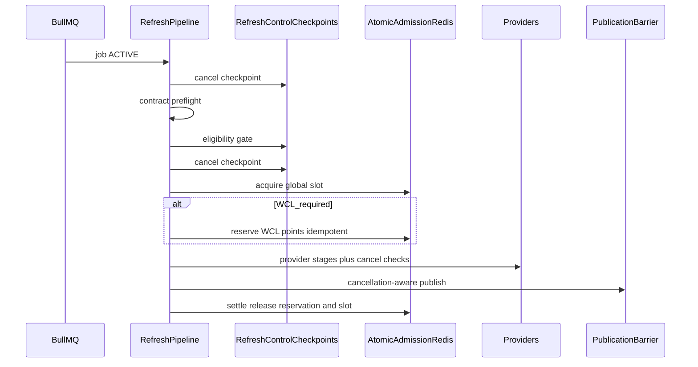

# Parallel character refresh scheduling

**Status:** Architecture plan (documentation only) — amended implementation-ready  
**Date:** 2026-07-31 (amended)  
**Branch:** `plan/refresh-concurrency`  
**Authority for product refresh semantics:** [`doc/architecture/refresh-lifecycle.md`](../../doc/architecture/refresh-lifecycle.md)  
**Related (cohort planner, not this plan):** [`doc/agents/wave4-bis/03-refresh-orchestration/`](../../doc/agents/wave4-bis/03-refresh-orchestration/)

This document designs safe parallel `refresh-character` processing. It does **not** activate concurrency, change BullMQ worker options, modify scoring, alter provider contracts, enable reservations in production, or wire priority/retries. Implementation must follow dependency order, rollout stages, and protected-file rules below.

---

## 0. Locked V1 decision index

| Topic | Locked V1 decision | Requires ADR later? |
|-------|--------------------|---------------------|
| Dependencies | Extend Bulk UX + Refresh Control; do not replace them | No |
| Local vs global concurrency | Separate knobs + distributed leased semaphore | No |
| Hard maxima | Both: per-process local hard max **and** environment global hard max | Raising either max → ADR |
| Emergency reserve | Fraction of `pointsLimit`, not `pointsRemaining` | No |
| Admission | Single atomic Redis operation (Lua); idempotent by `IngestionJob.id` | No |
| Leases | Renewable heartbeats; not fixed wall-time TTL | No |
| Authority | Redis = live admission; Postgres = durable audit; ledger = measured cost | No |
| Cost growth after admit | **Option A:** conservative worst-case reservation before first WCL spend | Option B top-ups → ADR |
| Retry | No BullMQ `attempts: 3` until durable retry SM proven; V1 = stall redelivery of non-terminal only + delayed **new** execution for classified retry | Enabling multi-attempt BullMQ → ADR |
| Priority mapping | Explicit BullMQ v5 mapper (never priority `0`) | Remap if BullMQ major changes |
| ETA | Throughput-based; `activeRefreshCount` is not the capacity denominator | No |
| Emergency vs STOP | Emergency may use reserve; hard STOP remains absolute; no V1 break-glass | Break-glass → ADR |
| Circuit breaker | Provider/transport failures only; not budget denials | No |
| Bulk + global PAUSED | Orchestrator **pauses its own ticks**; does not auto-cancel parent | Changing to “keep enqueueing” → product approval |

**Future alternatives** (not V1): regional multi-queue isolation; stage-based WCL reservation top-ups; BullMQ multi-attempt on same durable row; break-glass STOP bypass.

---

## 1. Goals

Support multiple character refreshes running concurrently while:

| Goal | Requirement |
|------|-------------|
| WCL credits | Respect live rate-limit **points** and DEFER/STOP floors |
| Emergency reserve | Preserve capacity derived from window `pointsLimit` for emergency admission |
| Compatibility | Direct refreshes and Bulk Processing share one admission path |
| UX | Approximate jobs ahead + waiting time with confidence (no false precision) |
| Admin | Reuse Refresh Control Center cancel / prioritize / kill-all |
| Barriers | Preserve contract preflight, eligibility gate, cancellation-aware publication |
| Dedupe | At most one in-flight logical refresh per character key |

**Invariant:** estimated WCL **points** are never treated as consumed provider spend. Settlement releases the hold and records measured points for audit/calibration only — it must **not** subtract measured cost again from the live rate snapshot.

---

## 2. Implementation dependencies (mandatory)

This concurrency programme **depends on** and **extends** these active branches. It must not invent parallel semantics.

### 2.1 `feat/admin-bulk-processing-ux`

Reuse without replacement:

| Capability | Contract to preserve |
|------------|----------------------|
| Explicit vs cohort selection | `BulkSelectionMode`: `COHORT` \| `EXPLICIT` |
| Child dispatch | Always via `enqueueRefreshCharacter` / `enqueueRecalculateScore` |
| Pause / cancel | Operation-level pause/cancel controls **future dispatch** |
| Parent `COMPLETED` | Means `CHILD_DISPATCH_FINISHED` — not child success |
| `childJobId` | Durable **`IngestionJob.id`**, never BullMQ execution id |
| `maxWclCalls` | Dispatch heuristic in **estimated calls**, not WCL points |

Coordinate with amended Bulk Processing UX contracts on that branch; do not assume the older main-only shape.

### 2.2 `feat/admin-refresh-control-center`

Reuse without replacement:

| Capability | Contract to preserve |
|------------|----------------------|
| `queueJobId` vs `IngestionJob.id` | Persist BullMQ execution id on the durable row; admin APIs key by IngestionJob id |
| Cooperative cancellation | QUEUED/delayed → terminal `CANCELLED` + queue remove; ACTIVE → `cancelRequestedAt` + checkpoints |
| `CANCELLED` terminal semantics | Already-terminal jobs are no-ops (`already_terminal`) |
| Kill-all | Point-in-time cancel/request across refresh jobs; does not permanently freeze Bulk |
| Centralized eligibility | `evaluateCharacterRefreshEligibility` / worker eligibility gate |
| Cancellation-aware publication | Atomic publication barrier that respects cancel requests |
| Admin job actions + audit | Existing cancel / prioritize / kill-all endpoints and audit conventions |

**Do not** propose another cancellation implementation, another eligibility gate, or parallel admin endpoints with conflicting semantics. Concurrency may **hook** release of Redis leases/slots into existing cancel paths.

### 2.3 Parallel refresh scheduling branches

Implement only after stages 1+ merge dependencies. Branch boundaries: §17.

---

## 3. Audit — current behavior (baseline on this worktree)

### 3.1 BullMQ queues and worker concurrency

| Queue | Worker | Explicit concurrency |
|-------|--------|----------------------|
| `refresh-character` | yes | omitted → BullMQ default **1** |
| `analyze-run` | yes | default **1** |
| `recalculate-score` | yes | default **1** |
| `generate-addon-export` | yes | default **1** |
| `discover-owned-characters` | yes | **1** |
| `bulk-character-processing` | yes | **1** |

No Queue-level `defaultJobOptions`. Enqueue options today: `jobId`, `removeOnComplete: 1000`, `removeOnFail: 1000`.

**Config naming debt:** `REFRESH_GLOBAL_CONCURRENCY` exists in `packages/config` / `RefreshPolicyConfig.globalConcurrency` (default 2) but is **not** applied to any `Worker`. Even after wiring, a value passed only to each Worker would remain **process-local**. This plan splits that concept (§4).

Installed BullMQ: `apps/worker` dependency `bullmq@^5.56.4` (priority semantics: §11).

### 3.2 Producer and processor

Producer: API / discovery / bulk → `enqueueRefreshCharacter` → dedupe → `persistAndEnqueue` → `queue.add`.

Processor: `Worker` → `withRetryClassification` → `runRefreshPipeline`.

Pipeline: mark active → contract preflight → providers → publication TOCTOU. Refresh Control adds eligibility + cancel checkpoints on its branch; this plan inserts admission **around** those barriers (§9), without duplicating them.

### 3.3 Dedupe and IngestionJob

- Unique `dedupeKey`; claim-before-add; BullMQ id `` `${dedupeKey}-${executionUuid}` ``.
- Statuses: `QUEUED` \| `ACTIVE` \| `COMPLETED` \| `FAILED` \| `CANCELLED`.
- Refresh Control adds: `queueJobId`, `cancelRequestedAt`, `cancelledAt`, `cancelReason`.

### 3.4 Cost ledger and WCL accounting

| Layer | Unit | Role |
|-------|------|------|
| Live provider rate budget | WCL **points** remaining/limit | WARN/DEFER/STOP |
| `WclBudgetManager` | WCL **points** estimates | Cohort planner today |
| Refresh cost ledger | Mixed estimated/measured provider costs | Calibration |
| Bulk `maxWclCalls` | Estimated **GraphQL-ish calls** (8 per full refresh) | Dispatch ceiling only |

These units must never be silently equated (§8).

### 3.5 Priority, retry, shutdown

- DB weights: high=10, normal=0, low=-10 — **not** passed to BullMQ today.
- Classified `delayMs` exists; BullMQ `attempts`/`backoff` not set.
- Graceful `worker.close()` on SIGTERM; stale QUEUED recovery is DB-side (15 min).

### 3.6 Status API

No `queuePosition` / ETA fields yet. Admin cancel/prioritize/kill-all land via Refresh Control — concurrency must call into those modules for release hooks, not fork them.

---

## 4. Global versus local concurrency

### 4.1 Locked model

BullMQ `Worker` concurrency is **process-local**. Passing a number to each Worker does **not** enforce an environment-wide cap.

| Knob | Meaning | Scope |
|------|---------|-------|
| `REFRESH_WORKER_CONCURRENCY` | Max concurrent refresh **processors** in one worker process | Per process |
| `REFRESH_GLOBAL_CONCURRENCY` | Max **admitted** refresh pipelines across all worker replicas in this environment | Environment-wide |
| `REFRESH_WORKER_HARD_MAX` | Absolute clamp on `REFRESH_WORKER_CONCURRENCY` | Per process (V1: **8**) |
| `REFRESH_GLOBAL_HARD_MAX` | Absolute clamp on `REFRESH_GLOBAL_CONCURRENCY` | Environment (V1: **8**) |

**Effective throughput** = minimum of:

- sum of local processor capacity across healthy replicas (each ≤ worker concurrency), and
- global admitted slot limit.

Local worker concurrency **may** be ≥ currently free global slots. Unadmitted jobs **must not** begin provider work (including WCL). They may sit in BullMQ ACTIVE only long enough to hit the admission gate, then delay/requeue without provider side effects — preferred V1: acquire global slot **before** any provider call (§9).

### 4.2 Distributed leased semaphore (global slots)

Required behavior:

| Rule | Detail |
|------|--------|
| Acquire | Each admitted refresh obtains exactly one global slot |
| Atomic | Slot acquire is part of / paired with the atomic admission path (§6) |
| Scope | Keys include environment id (`APP_ENV` / deploy namespace) |
| Identity | Slot owner = `IngestionJob.id` (idempotent) |
| Renew | Active healthy workers renew the slot lease via heartbeat |
| Release | Completion, failure, cancellation release the slot |
| Crash | Missed heartbeats → eventual expiry; sweeper reconciles |
| No fixed wall TTL steal | An active healthy job must **not** lose its slot solely because wall time exceeded a fixed duration; renewals keep ownership |
| Cap | Global count never exceeds configured limit across replicas |

### 4.3 Hard maximum applicability

**Both** apply in V1:

- Local hard max protects each process (CPU/FD/provider HTTP piles).
- Global hard max protects the environment (WCL + shared DB pressure).

Raising either hard max requires an ADR backed by load-test evidence.

### 4.4 Config migration note (docs only)

Existing `REFRESH_GLOBAL_CONCURRENCY` in config today is misnamed relative to this plan. Implementation must:

1. Introduce `REFRESH_WORKER_CONCURRENCY` for process-local Worker concurrency.
2. Redefine `REFRESH_GLOBAL_CONCURRENCY` as the distributed semaphore limit.
3. Until activation flags are on, both remain unused for live admission (effective concurrency stays 1).

---

## 5. Emergency reserve mathematics

### 5.1 Units

| Term | Unit | Meaning |
|------|------|---------|
| `pointsLimit` | integer WCL rate-limit points | Capacity of the current WCL rate window |
| `pointsRemaining` | integer WCL rate-limit points | Points left in that window (from provider snapshot) |
| `emergencyReservePoints` | integer points | Preserved for emergency admission |
| `activeReservedPoints` | integer points | Sum of live Redis reservation holds for this window |
| `estimatedRefreshCostPoints` | integer points | Conservative envelope for one refresh |
| GraphQL requests | requests | Not points |
| Bulk `maxWclCalls` | estimated calls | Dispatch heuristic only |
| Ledger measured cost | points (when WCL) | Audit/calibration after the fact |

### 5.2 Locked formulas

```text
emergencyReservePoints =
  max(
    floor(pointsLimit * REFRESH_SAFETY_RESERVE_FRACTION),
    REFRESH_MIN_EMERGENCY_RESERVE_POINTS
  )

normalAvailablePoints =
  max(0, pointsRemaining - emergencyReservePoints - activeReservedPoints)

emergencyAvailablePoints =
  max(0, pointsRemaining - activeReservedPoints)
```

**Do not** compute reserve as `pointsRemaining * fraction` — that shrinks the reserve as the budget is consumed.

Defaults (implementation config; not activated by this doc):

| Knob | Suggested default |
|------|-------------------|
| `REFRESH_SAFETY_RESERVE_FRACTION` | `0.1` (existing intent) |
| `REFRESH_MIN_EMERGENCY_RESERVE_POINTS` | `50` (tunable; ADR if changed materially) |

Rounding: all accounting in **integers**; use `floor` for reserve; never float Redis counters for points.

### 5.3 Snapshot freshness and fail-closed rules

| Condition | Behavior for **new WCL-heavy** admissions |
|-----------|-------------------------------------------|
| Snapshot missing | Fail closed — no reservation |
| Snapshot older than `REFRESH_WCL_SNAPSHOT_MAX_AGE_SECONDS` | Fail closed |
| `pointsLimit` unknown / non-finite | Fail closed |
| Near `resetAt` but snapshot still fresh | Admit using current window identity; do not invent next-window budget |
| Window rollover (`resetAt` / window id changes) | New window-scoped totals; old window keys expire; rebuild from durable rows if needed |

Non-WCL refreshes still need a global concurrency slot but **no** WCL reservation (§9).

### 5.4 Emergency versus provider floors

| Layer | Policy |
|-------|--------|
| Normal / bulk admission | Uses `normalAvailablePoints` only — stops early enough to preserve `emergencyReservePoints` |
| Emergency admission | May use `emergencyAvailablePoints` (includes the preserved reserve) |
| Provider WARN | Observability; does not by itself admit or deny |
| Provider DEFER | Soft gate for expensive work inside provider; admission should also refuse new WCL-heavy starts when snapshot indicates defer territory for **normal** traffic |
| Provider STOP | **Absolute** safety boundary for V1 — emergency override does **not** bypass STOP |
| Rate-window reset | New window; emergency reserve recomputed from new `pointsLimit` |

**No V1 break-glass** bypass of hard STOP. Any future bypass requires a separate approved ADR.

Emergency override still requires: Refresh Control cancel checks, contract preflight, eligibility, global slot, and audit (`refresh_emergency_override`).

---

## 6. Atomic admission

### 6.1 Unsafe sequence (forbidden)

1. Read `pointsRemaining`  
2. Read reservation total  
3. Calculate in application code  
4. Create reservation  

Multiple workers can pass simultaneously.

### 6.2 Required atomic operation

One Redis Lua script (or equivalent transactional primitive) performs:

1. Verify `schedulingState` ∈ allow-set (`RUNNING`, or `CIRCUIT_OPEN` half-open probe rules).
2. Verify rate snapshot exists and age ≤ max.
3. Verify caller’s `windowId` matches stored window identity (from `resetAt` / limit epoch).
4. Read `activeReservedPoints` for that window.
5. Compute `normalAvailablePoints` or `emergencyAvailablePoints`.
6. Reject with typed reason when insufficient (`INSUFFICIENT_RESERVED_CAPACITY`).
7. If `IngestionJob.id` already has an active reservation → **return existing** (idempotent; no double debit).
8. Create per-job reservation hash fields (points, mode, lease expiry, owner).
9. Register lease expiry score in a sorted set.
10. Increment window-scoped reserved total by integer points.
11. Acquire global concurrency slot for the same `IngestionJob.id` (idempotent) when not already held.
12. Return resulting balances + reservation metadata.

Application code must not “check then set” outside this script.

### 6.3 Idempotency

Reservation and slot identity = **`IngestionJob.id`**.

Repeated admission attempts for the same job must not double-reserve points or slots. Heartbeat renewal updates lease timestamps only.

---

## 7. Renewable leases (not fixed wall-time TTL)

### 7.1 Locked model

Reservation ownership and global slot ownership are **renewable leases**.

| Rule | Detail |
|------|--------|
| Lease duration | Short (e.g. 30–60s); shorter than max allowed no-heartbeat interval |
| Renewal | Worker renews while job remains actively admitted |
| Ownership check | Renewal succeeds only if same `IngestionJob.id` still owns the lease |
| Cancel | Stops renewal and releases reservation + slot |
| Complete / fail | Releases immediately |
| Crash | Missed heartbeats → lease expires → sweeper reconciles |
| Sweeper | Never releases a lease for a healthy owner that is still renewing |
| Stall / retry | Same durable non-terminal job reacquires or adopts reservation **idempotently** |

**Do not** require reservation TTL ≥ full refresh wall time. Long refreshes survive by heartbeat.

### 7.2 Sweeper

Periodic bounded batches (ZSET range by score ≤ now, limit N):

1. Load expired lease job ids from Redis.  
2. Compare to Postgres `RefreshAdmission` + `IngestionJob` + BullMQ state (via `queueJobId`).  
3. If owner healthy/active and heartbeat race → skip.  
4. Else release Redis holds and mark durable admission `EXPIRED` / trigger safe fail path.

Never use `KEYS`. Never unbounded `SCAN` on the hot path; rebuild jobs use **bounded** `SCAN`/`SSCAN` with cursor persistence only in maintenance mode.

---

## 8. Estimation units and cost envelopes

### 8.1 Exact units

| Estimator / counter | Returns | May reserve WCL points? |
|---------------------|---------|-------------------------|
| `WclBudgetManager.estimateCharacterRefreshCost` (calibrated) | **Integer WCL points** | Yes (after calibration) |
| Ledger EMA of measured WCL point deltas | **Integer WCL points** | Yes |
| Unknown estimate | Conservative **non-zero** point envelope | Yes |
| Bulk `ESTIMATED_WCL_CALLS_PER_FULL_REFRESH = 8` | Estimated **calls** | **No** — dispatch heuristic only |
| GraphQL request counts | Requests | No |

**No conversion from calls → points** without measured calibration.

### 8.2 Scenarios (separate envelopes)

| Scenario | Intent | Reservation posture |
|----------|--------|---------------------|
| Cold | Full discovery + fights + survival | Highest conservative points envelope |
| Warm | Partial reuse of evidence | Mid envelope from EMA |
| Rankings-only | Narrow WCL surface | Low envelope |
| Fallback / unknown | Missing calibration | Conservative non-zero envelope (never 0) |
| Non-WCL | Model-only / no WCL stage | **0 points reserved**; global slot still required |

### 8.3 Cost growth after admission — Option A (locked V1)

**V1:** reserve a **conservative worst-case** integer point envelope for the planned WCL work **before** the first WCL-spending stage.

**Not V1 (future ADR):** stage-based atomic top-ups before additional expensive WCL stages. If later introduced, top-up failure must stop before that stage and preserve last-known-good per existing refresh semantics.

Settlement:

1. Release estimated hold from Redis totals.  
2. Persist measured consumption on Postgres + cost ledger.  
3. Update EMA calibration.  
4. **Do not** subtract measured cost again from live `pointsRemaining` (provider already consumed those points).

---

## 9. Exact pipeline / admission sequence

One locked order (extends Refresh Control + existing pipeline; does not fork barriers):

```text
 1. BullMQ job becomes ACTIVE through existing persistence semantics
    (IngestionJob ACTIVE, attempts/queueJobId as implemented by Control/enqueue)
 2. Cancellation checkpoint          ← Refresh Control
 3. Refresh-contract preflight       ← existing pipeline helper
 4. Centralized refresh eligibility  ← Refresh Control / config eligibility
 5. Cancellation checkpoint
 6. Acquire global concurrency slot  ← distributed semaphore (atomic)
 7. Determine whether WCL work is required for this execution plan
 8. If WCL required: atomically reserve WCL points (normal or emergency mode)
    before the first WCL-spending stage
 9. Provider stages with cancellation checkpoints
10. (Future only) stage-based reservation top-ups — not V1
11. Atomic cancellation-aware publication barrier  ← Refresh Control / pipeline
12. Settle/release WCL reservation (if any) and release global slot
```

### 9.1 Diagram



### 9.2 Zero-cost failure paths

| Outcome | Global slot | WCL reservation | WCL points spent |
|---------|-------------|-----------------|------------------|
| Cancel before admit | No | No | No |
| Contract preflight fail | No (release if acquired only after preflight — per sequence, slot is after preflight/eligibility) | No | No |
| Eligibility fail | No | No | No |
| Insufficient capacity | Slot not held / released; job delayed without provider work | No | No |
| Non-WCL success | Yes (held then released) | No | No |

Ineligible jobs and contract-preflight failures acquire **no** WCL reservation and consume **no** WCL points.

**Do not** duplicate preflight or eligibility implementations for admission.

---

## 10. Retry state machine

### 10.1 Two retry classes

| Class | Meaning |
|-------|---------|
| **1. Queue delivery / stall retry** | BullMQ redelivers the **same** durable execution while `IngestionJob` is still non-terminal |
| **2. Application retry** | After a classified retryable **terminal** outcome, create a **new** durable execution (`IngestionJob` + new BullMQ execution id) after delay |

### 10.2 Locked V1 approach

1. **Do not** set BullMQ `attempts: 3` (or any `attempts > 1` that resurrects terminal rows) until a durable retry state machine is proven.  
2. Allow class-1 stall/redelivery only while the durable row remains non-terminal (`ACTIVE` / cancel-requested handling as Control defines). Processor must re-run cancel checks, eligibility, and contract preflight; admission is idempotent by `IngestionJob.id`.  
3. For classified retryable failures that today mark the row `FAILED`: V1 creates a **new** execution after `delayMs` (application scheduler / delayed enqueue), subject to dedupe rules and cancellation. **Never** silently resurrect a terminal row in-place.  
4. Keep retry/backoff wiring on a **separate implementation branch** from concurrency activation unless deferral of admission absolutely requires delayed re-enqueue (then use delay without multi-attempt completion semantics).

### 10.3 Required properties

| Property | Rule |
|----------|------|
| DB ↔ BullMQ agreement | Terminal DB ⇒ no further provider work on that execution |
| Classification delay | Respected on application re-enqueue |
| No silent resurrection | `FAILED`/`CANCELLED`/`COMPLETED` stay terminal |
| Attempts auditable | `IngestionJob.attempts` / admission metadata |
| Cancel prevents retry | Honor `cancelRequestedAt` / `CANCELLED` |
| Barriers rerun | Preflight + eligibility on every execution start |
| Provider stages | Idempotent or safely repeatable |
| Publication | Cancellation-aware barrier unchanged |
| Bulk `childJobId` | Remains the child `IngestionJob.id`; if a new execution replaces a failed child, bulk semantics for ID updates must follow Bulk UX rules (document at implementation; default: leave historical `childJobId`, do not rewrite without product approval) |

---

## 11. Priority mapping (BullMQ v5)

### 11.1 Durable product weights (unchanged)

| Payload | DB `IngestionJob.priority` |
|---------|----------------------------|
| `high` | `10` |
| `normal` | `0` |
| `low` | `-10` |

### 11.2 Installed BullMQ semantics (`bullmq@^5.56.4`)

Documented BullMQ v5 behavior:

- Priority option range for prioritized jobs: **1 … 2 097 151**.
- **Lower** BullMQ priority number = **higher** urgency.
- Priority **`0` / omitted = “no priority”** and is processed **before** any prioritized job.

Therefore V1 **must never** enqueue refresh jobs with BullMQ priority `0` or omit priority once priority rollout is enabled — otherwise legacy “no priority” jobs outrank mapped work.

### 11.3 Locked mapper (verify again at implementation against installed version)

```text
function toBullmqPriority(dbWeight: number): number {
  // DB: high=10, normal=0, low=-10 (and aging may add temporary effective weight in ETA only)
  if (dbWeight >= 10) return 1;    // high
  if (dbWeight >= 0)  return 50;   // normal
  return 100;                      // low
}
```

| Requirement | How met |
|-------------|---------|
| Highest urgency first | `1` before `50` before `100` |
| FIFO among equals | Same BullMQ priority ⇒ FIFO |
| No accidental outrank by default | Always set explicit priority ∈ {1,50,100} after rollout |
| Pre-rollout jobs | Migration/drain: on priority flag enable, backfill `changePriority` for waiting jobs or drain queue first (ops step) |
| Reprioritize | Refresh Control `prioritizeRefreshJob` updates DB weight **and** `job.changePriority({ priority })` via `queueJobId` |
| Aging / fairness | **Do not** rewrite every queued job’s BullMQ priority on a timer. Aging affects **ETA / admission preference / effective weight in read models**; optional sparse promote API for starved jobs only |

Implementation must re-read BullMQ’s installed guide and freeze the numeric map in code comments + tests. Remapping requires a documented change if BullMQ major semantics shift.

---

## 12. Queue position and ETA

### 12.1 Definitions

| Field | Meaning |
|-------|---------|
| `activeRefreshCount` | Currently **admitted** active refresh jobs (holding a global slot) |
| `effectiveWorkerCapacity` | Currently available global refresh slots under healthy scheduling (`REFRESH_GLOBAL_CONCURRENCY - activeRefreshCount`, or 0 if paused/circuit) |
| `observedThroughput` | Completions per second from bounded moving window or EMA |
| `queuePosition` | Approximate number of **eligible** jobs expected **ahead** under current priorities (UI: “Approximate jobs ahead”) |
| `estimatedWaitSeconds` | Derived primarily from jobs ahead ÷ throughput; coarse buckets |
| `estimateConfidence` | `LOW` \| `MEDIUM` \| `HIGH` |
| `schedulingState` | `RUNNING` \| `PAUSED` \| `RATE_LIMITED` \| `CIRCUIT_OPEN` \| `DRAINING` |

**Do not** use `activeRefreshCount` alone as the service-capacity denominator for ETA.

### 12.2 Recommended estimate

```text
if schedulingState in {PAUSED, DRAINING} or snapshot_stale or WCL_admit_blocked_indefinitely:
  estimatedWaitSeconds = null
  estimateConfidence = LOW
else if observedThroughput samples sufficient:
  rawWait = queuePosition / observedThroughput
else if effectiveWorkerCapacity > 0:
  rawWait = queuePosition / effectiveWorkerCapacity * emaDurationSeconds
else if activeRefreshCount == 0 and effectiveWorkerCapacity > 0:
  rawWait = 0   // about to start; still coarse-bucket
else:
  estimatedWaitSeconds = null
  estimateConfidence = LOW

estimatedWaitSeconds = bucket(rawWait)  // e.g. 30s / 5m buckets
```

### 12.3 Confidence rules

| Condition | Confidence |
|-----------|------------|
| Healthy RUNNING, strong throughput samples, similar costs | HIGH |
| Fallback duration EMA, moderate samples | MEDIUM |
| Low-priority job (may be overtaken by future high/normal) | ≤ MEDIUM (typically LOW–MEDIUM) |
| Heterogeneous estimated costs in queue | Lower by one step |
| Circuit open / rate-limited / paused / stale snapshot | LOW + null wait |
| Never claim exact BullMQ rank | Always approximate |

### 12.4 Position counting rules

Include only eligible, non-terminal, non-cancel-requested refresh jobs expected ahead by priority then `scheduledAt`.

Exclude: `CANCELLED`, cancel-requested, terminal, ineligible, invalid contract executions.

Account for delayed/deferred jobs **separately** (not silently mixed into “ahead” as if runnable now).

### 12.5 Situational behavior

| Situation | ETA behavior |
|-----------|--------------|
| No active jobs but capacity free | Position may be 0; wait null or 0-bucket; MEDIUM/HIGH if healthy |
| All global slots occupied | Wait from throughput or duration×queue/capacity fallback |
| Multi-replica | Use **global** active/capacity/throughput, not per-process |
| WCL circuit open | Null wait for WCL-heavy; note state; non-WCL may still progress |
| Normal blocked by emergency reserve | State reflects deferral; low confidence |
| Non-WCL path | ETA uses global slots only (no WCL defer) |
| High-priority arrivals | May overtake; lowers confidence for low-priority ETAs |
| Bulk low-priority backlog | Large approximate ahead counts OK; coarse buckets; low confidence |

DTO additions remain additive/optional on `JobStatusDTO` / refresh-status responses.

---

## 13. Circuit breaker semantics

### 13.1 Separate signal classes

| Signal | Counts toward circuit? |
|--------|------------------------|
| `INSUFFICIENT_RESERVED_CAPACITY` | **No** — expected deferral |
| Normal queue pressure / full global slots | **No** |
| `RATE_LIMITED` window state | Sets `schedulingState` / deferrals; not automatic circuit open by itself |
| `PROVIDER_UNAVAILABLE` / transport failures | **Yes** — circuit evidence |
| Invalid contract / ineligible character | **No** — terminal non-provider |

Circuit opens only on defined provider/transport failure events (retain existing consecutive-failure idea from `WclBudgetManager`, but **exclude** budget denials).

### 13.2 Half-open probe

A half-open probe must:

- Hold one valid global slot and (if WCL) one reservation via atomic admission.
- Remain subject to cancellation, eligibility, and contract barriers.
- On success → close circuit; on failure → re-open.

---

## 14. Bulk compatibility

Preserve Bulk UX semantics:

| Topic | Rule |
|-------|------|
| Parent `COMPLETED` | Child dispatch finished only |
| `maxWclCalls` | Dispatch heuristic (estimated calls) |
| Children | Shared admission path only |
| `childJobId` | `IngestionJob.id` |
| Pause/cancel | Control future dispatch |
| Child cancel | Refresh Control semantics |

### 14.1 Locked product/ops choice: global PAUSED

- Global `PAUSED` **prevents child admission** (and provider work).
- Global `PAUSED` does **not** automatically cancel the bulk parent.
- Bulk orchestrator **must pause its own ticks** while global scheduling is `PAUSED` / `DRAINING` (do not keep enqueueing into a paused system). Changing this requires product approval.

### 14.2 Kill-all interaction

Kill-all is **point-in-time**. Bulk may enqueue **new** children later unless the bulk operation itself is paused/cancelled. Ops runbooks should pause/cancel bulk before/after kill-all when a freeze is intended.

### 14.3 Fairness

Low-priority bulk jobs may receive starvation aging in the **read model / sparse promote** sense (§11) without overtaking direct/admin improperly.

---

## 15. Redis and Postgres authority

### 15.1 Locked V1 authorities

| Store | Authority for |
|-------|----------------|
| **Redis** | Atomic live admission; active lease ownership; global slot count; window-scoped reserved total; scheduling state |
| **Postgres `RefreshAdmission`** | Durable audit; job association; estimated/measured values; final settlement state |
| **Cost ledger** | Measured provider consumption; calibration source |
| **ETA/EMA keys** | **Non-authoritative** cache only |

### 15.2 Partial-failure protocol (idempotent by `IngestionJob.id`)

| Failure | Recovery |
|---------|----------|
| Redis admit OK, Postgres mirror write fails | Retry mirror; sweeper/reconciler repairs from Redis owner set; admit remains valid |
| Postgres row exists, Redis missing | Reconciler: if job still admitted/active → re-create Redis lease idempotently from durable estimate; else mark durable released |
| Redis restart | Fail closed for **new WCL** admissions until snapshot refreshed and active reservations rebuilt from durable non-settled admissions + BullMQ/Control state |
| Crash before mirror persist | Lease expiry + sweeper; no permanent debit |
| Settlement succeeds in one store only | Idempotent settle: release Redis if present; mark Postgres SETTLED; ledger write once |

Startup must **not** require a perfect ETA cache. Startup **must** fail closed for new WCL-heavy admissions until:

- rate snapshot is fresh, and  
- reservation/slot rebuild has completed (or empty-and-verified).

### 15.3 Precise Redis structures (environment-scoped)

Prefix: `mplus:{env}:refresh:`

Window id: derived from WCL `resetAt` (and limit identity), e.g. `win:{resetAtEpochSec}`.

| Key | Type | Purpose |
|-----|------|---------|
| `{prefix}sched:state` | string | Scheduling state |
| `{prefix}wcl:snap` | hash | `pointsRemaining`, `pointsLimit`, `resetAt`, `fetchedAt`, `windowId` (integers/strings) |
| `{prefix}wcl:{windowId}:reserved:total` | string int | Window-scoped reserved points total |
| `{prefix}wcl:{windowId}:res` | hash | field=`ingestionJobId` → reserved integer points |
| `{prefix}wcl:lease` | zset | score=leaseExpiryMs, member=`ingestionJobId` |
| `{prefix}slot:owners` | hash | field=`ingestionJobId` → leaseExpiryMs / worker id |
| `{prefix}slot:lease` | zset | score=leaseExpiryMs, member=`ingestionJobId` |
| `{prefix}slot:count` | string int | Active global slots (maintained atomically with owners) |
| `{prefix}ema:*` | string/hash | **Non-authoritative** ETA/cost EMA cache |

Rules:

- Integer-only point and slot counters.
- No `KEYS`; no unbounded hot-path `SCAN`.
- Cleanup after window reset: drop old window total/hash via known window id (store previous window id in snap).
- Rebuild: bounded batches from Postgres non-settled admissions.
- Atomic total updates only inside Lua with reservation create/release.

---

## 16. Persistence

### 16.1 `RefreshAdmission` (durable audit)

```text
RefreshAdmission {
  id, jobId UNIQUE → ingestion_jobs.id,
  characterId?,
  status: RESERVED | SETTLED | RELEASED | EXPIRED | CANCELLED,
  estimatedWclPoints int,
  measuredWclPoints int?,
  emergencyOverride bool,
  windowId text,
  reservedAt, leaseExpiresAt, settledAt?,
  metadata jsonb
}
```

Postgres does **not** authorize live concurrent admits; Redis does.

### 16.2 Migration needs

Additive only. No activation of concurrency in the same PR as schema. Coordinate with Refresh Control’s `queue_job_id` / cancel columns (already on that branch).

---

## 17. Rollout order (revised)

| Stage | Scope | Concurrency | Notes |
|-------|-------|-------------|-------|
| **0** | This documentation | 1 | Docs only |
| **1** | Merge `feat/admin-bulk-processing-ux` + `feat/admin-refresh-control-center`; metrics/audit only | 1 | No admission enforcement |
| **2** | Durable admission model + Redis atomic reservation/lease; **shadow mode** (predict vs serial reality) | 1 | Compare only |
| **3** | **Enforce** admission; validate settle/recovery | 1 | Still serial execution |
| **4** | Expose scheduling state + approximate ETA fields (nullable) | 1 | Backward-compatible DTOs |
| **5** | Wire BullMQ priority mapper; concurrency still 1 | 1 | Explicit priorities only |
| **6** | Non-prod `REFRESH_GLOBAL_CONCURRENCY=2` across **multiple worker replicas**; crash/load tests | 2 global | Local worker concurrency configured deliberately |
| **7** | Production canary global concurrency 2 | 2 | Evidence gate |
| **8** | Higher limits only with evidence + ADR | ≤ hard max | |

Retry-policy changes remain a **separate rollout** unless required for safe admission deferral (delayed re-enqueue without multi-attempt terminal resurrection).

**This document activates none of stages 1–8.**

---

## 18. Branch boundaries

| Branch | Scope | Depends on |
|--------|-------|------------|
| (deps) | Merge Bulk UX + Refresh Control | — |
| `feat/refresh-admission-shadow` | Redis/Postgres admission + shadow logs | deps |
| `feat/refresh-admission-enforce` | Enforce admit @ concurrency 1 | shadow |
| `feat/refresh-eta-fields` | DTO + read model | enforce recommended |
| `feat/refresh-bullmq-priority` | Mapper + `changePriority` integration with Control | enforce |
| `feat/refresh-global-concurrency` | Distributed semaphore activation flags | priority + enforce |
| `feat/refresh-retry-state-machine` | Class-2 durable retries (separate) | Control |

Extend Control cancel paths to call reservation/slot release — **do not** replace Control modules.

---

## 19. Configuration (future; not activated here)

| Knob | Role |
|------|------|
| `REFRESH_WORKER_CONCURRENCY` | Per-process BullMQ concurrency |
| `REFRESH_GLOBAL_CONCURRENCY` | Environment admitted pipeline cap |
| `REFRESH_WORKER_HARD_MAX` | 8 |
| `REFRESH_GLOBAL_HARD_MAX` | 8 |
| `REFRESH_SAFETY_RESERVE_FRACTION` | Reserve from `pointsLimit` |
| `REFRESH_MIN_EMERGENCY_RESERVE_POINTS` | Floor reserve |
| `REFRESH_WCL_SNAPSHOT_MAX_AGE_SECONDS` | Fail closed if stale |
| `REFRESH_LEASE_TTL_MS` | Lease length (renewed) |
| `REFRESH_LEASE_HEARTBEAT_MS` | Renewal period |
| `REFRESH_ADMISSION_MODE` | `off` \| `shadow` \| `enforce` |
| `REFRESH_ETA_ENABLED` | Populate DTO fields |
| `REFRESH_PRIORITY_IN_BULLMQ` | Apply mapper |
| `REFRESH_CONCURRENCY_ENABLED` | Apply global/local caps |

---

## 20. Observability

Events: `refresh_admission_reserved`, `refresh_admission_deferred` (`INSUFFICIENT_RESERVED_CAPACITY`), `refresh_admission_settled`, `refresh_lease_renewed`, `refresh_lease_expired`, `refresh_slot_acquired`, `refresh_slot_released`, `refresh_scheduling_state_changed`, `refresh_eta_computed`, `refresh_emergency_override`.

Alerts: reservation/slot drift after reconcile; sustained fail-closed snapshot; circuit open; global count > configured limit (should be impossible — page if observed).

---

## 21. Failure recovery

| Failure | Recovery |
|---------|----------|
| Worker crash mid-refresh | Leases expire after missed heartbeats; sweeper releases; Control/pipeline terminal rules apply; class-1 redelivery if non-terminal |
| Cancel before reservation | No Redis WCL hold; slot not held |
| Cancel after reservation | Stop heartbeats; atomic release; durable CANCELLED via Control |
| Cancel during future top-up | N/A in V1 (Option A); if top-ups added later, release and stop before next WCL stage |
| Publication cancel race | Control’s cancellation-aware barrier wins; then settle/release |
| Redis loss | Fail closed WCL admits; rebuild from Postgres; ETA cache irrelevant |

Cancellation release must be **idempotent** and ordered: durable cancel request/terminal mark (Control) → stop heartbeat → Lua release reservation+slot → audit. “Best-effort abort” alone is insufficient: ACTIVE work stops at Control checkpoints; RELEASE is mandatory and retryable until Redis and Postgres agree.

---

## 22. Test matrix

### 22.1 Core (retained)

T1–T16 style cases from prior draft remain in spirit: dedupe, bulk child path, contract/eligibility zero reservation, priority ordering, etc.

### 22.2 Required additions

| ID | Case |
|----|------|
| M1 | Two worker replicas respect one global slot limit |
| M2 | Simultaneous atomic reservations cannot overspend window |
| M3 | Same-job idempotent reservation / slot |
| M4 | Stale rate snapshot → fail closed WCL admit |
| M5 | WCL reset-window rollover isolates totals |
| M6 | Reserve total reconstruction after Redis restart |
| M7 | Postgres mirror failure then repair |
| M8 | Lease heartbeat keeps ownership beyond one lease interval |
| M9 | Healthy job exceeding one lease duration still admitted |
| M10 | Worker crash → expiry → no leak |
| M11 | Stalled BullMQ retry adopts reservation idempotently |
| M12 | Estimate vs measured overshoot calibration (no second debit) |
| M13 | Emergency vs normal availability math |
| M14 | Hard STOP still blocks emergency |
| M15 | Cancel before and after reservation |
| M16 | Contract mismatch → zero reservation |
| M17 | Eligibility failure → zero reservation |
| M18 | Publication cancellation race |
| M19 | DB/BullMQ retry-state consistency (no terminal resurrection) |
| M20 | Priority ordering on installed BullMQ version (incl. no priority-0) |
| M21 | ETA with zero active jobs but free capacity |
| M22 | ETA with multiple replicas (global throughput) |
| M23 | Low-priority confidence degradation |
| M24 | Bulk parent continues after point-in-time kill-all unless bulk paused/cancelled |
| M25 | Global PAUSED → bulk ticks pause; parent not auto-cancelled |
| M26 | No reservation/slot leaks after every terminal path |
| M27 | Delayed sweeper does not steal healthy renewed leases |
| M28 | Non-WCL refresh takes global slot only |

---

## 23. Load-test plan

| Scenario | Shape | Pass criteria |
|----------|-------|---------------|
| L1 Interactive burst | Direct enqueues, global=2, ≥2 replicas | Global active ≤ 2; no duplicate ACTIVE per character |
| L2 Bulk flood + direct | Bulk low + direct normal/high | Direct preferenced; emergency floor preserved |
| L3 Crash drill | Kill replica mid-lease | No permanent holds after sweeper; counts consistent |
| L4 Snapshot stale | Freeze snapshot age | Fail closed WCL; non-WCL may proceed |
| L5 Window rollover | Force reset identity change | Totals isolated; no cross-window debit |
| L6 Long refresh | Runtime ≫ lease TTL | Heartbeats keep slot/reservation |

---

## 24. Protected files

### Must not change for concurrency work

| Path / concern | Reason |
|----------------|--------|
| Scoring packages / public dimensions | Product invariants |
| Provider DEFER/STOP threshold **semantics** | Rate contract |
| Refresh Control cancellation SM | Extend, don’t replace |
| Eligibility policy module | Reuse |
| Bulk UX completion / `childJobId` semantics | Reuse |

### Expected careful touch points (later branches)

| Path | Role |
|------|------|
| New admission module (worker) | Lua + leases + semaphore |
| Refresh Control cancel paths | Hook release |
| `processors.ts` / `queues.ts` | Gated concurrency + priority |
| `refresh-pipeline.ts` | Insert admit steps at locked sequence only |
| Contracts DTOs | Additive ETA fields |
| Prisma | `RefreshAdmission` additive |

### Exact do-not-bypass

- `dedupe.ts` mutual exclusion  
- Bulk → producers only  
- Control admin endpoints (no parallel cancel API)  
- Contract preflight + cancellation-aware publication  

---

## 25. Relationship to cohort scheduler

Cohort planner decides **who** over hours/days. This plan governs **how** in-flight refreshes share global slots and WCL point reservations. Future live cohort enqueue must use the same producers + admission path.

---

## 26. Non-goals

- Activating concurrency, priority, retries, or reservations in this documentation commit  
- Replacing Bulk UX or Refresh Control  
- Equating bulk calls with WCL points  
- Break-glass STOP bypass  
- BullMQ `attempts: 3` without durable retry SM  
- Treating Redis EMA/ETA keys as admission authority  

---

## 27. Implementer summary

V1 safe parallelism requires **two** concurrency controls (local Worker + global leased semaphore), **atomic** window-scoped WCL point reservation with renewing leases, reserve math from **`pointsLimit`**, and a single pipeline order that reuses Refresh Control cancellation/eligibility and Bulk UX dispatch semantics. ETA is approximate and throughput-based. Retry multi-attempt on terminal rows is out of scope until a dedicated state machine lands. Nothing in this document turns those behaviors on.
