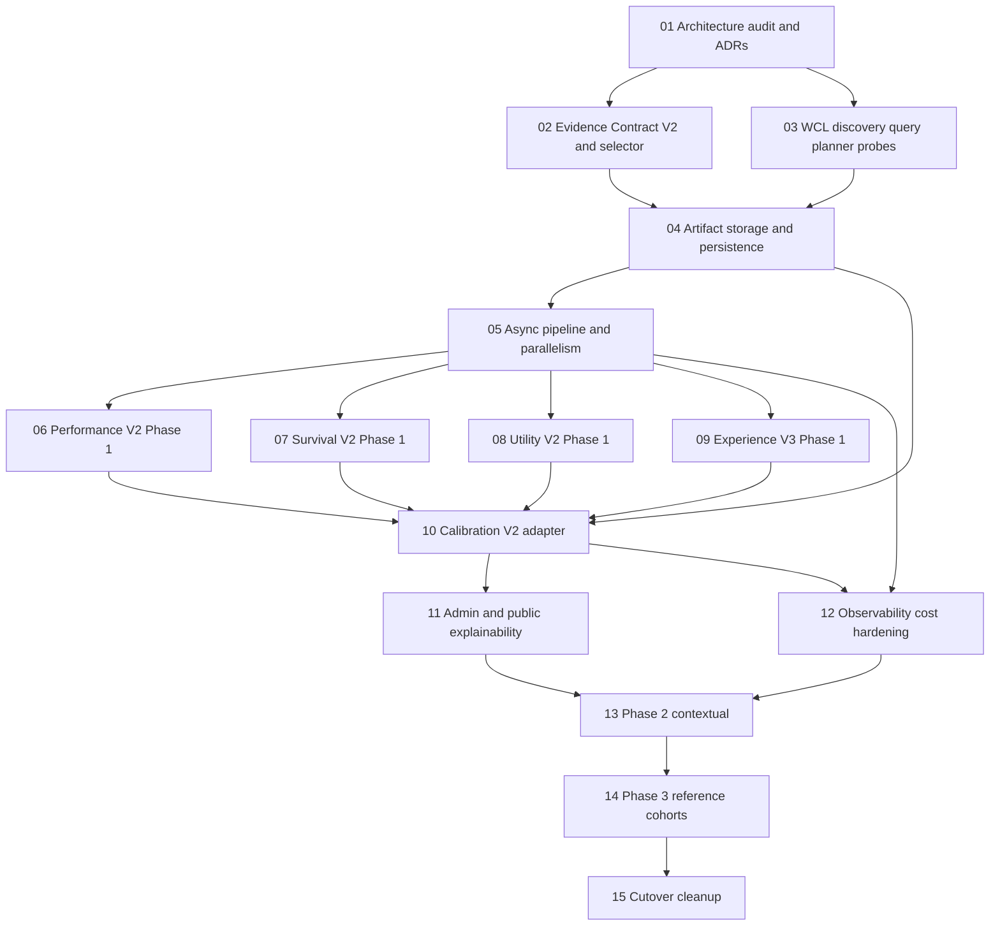
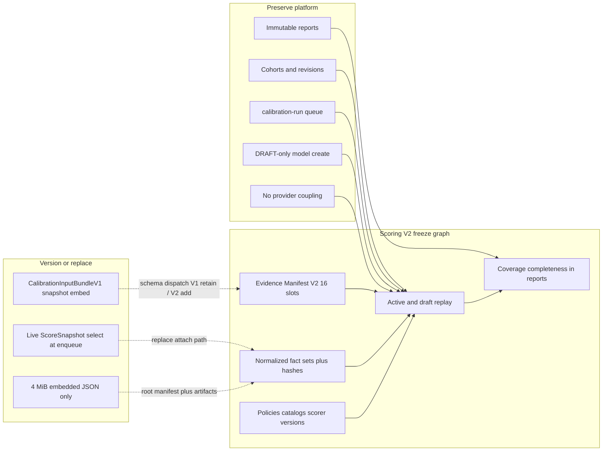

# Scoring V2 — Implementation dependency graph

Companion to [`IMPLEMENTATION_BASELINE.md`](./IMPLEMENTATION_BASELINE.md). Defines workstream order, file ownership conflicts, branch names, and live-probe gates. No runtime changes in this checkpoint.

Prompt numbers refer to `.cursor-orchestration/mplus-scoring-v2-agent-kit/prompts/`.

---

## 1. Dependency DAG



**Invariant:** no dimension formula work (06–09) before Evidence Contract (02) and persistence for manifests/facts (04). Calibration V2 (10) consumes frozen V2 evidence — it does not invent a second selection path.

---

## 2. Calibration → Scoring V2 adaptation edges



Population-based recommendations: **no edge into digests** until Prompt 14 critical-mass gates pass.

---

## 3. File conflict matrix

Two prompts **must not** edit the same hot file concurrently. Cells: `serial` = serialize; `coord` = parallel only with agreed interface owner; `ok` = safe parallel; `—` = N/A.

### 3.1 Hot ownership zones

| Zone | Primary paths | Owner prompt(s) |
|------|---------------|-----------------|
| Evidence contracts / selector | `packages/scoring/src/selection/*`, new evidence-manifest modules, `packages/contracts` evidence types | **02** |
| WCL provider / planner | `packages/providers/warcraftlogs/**`, probe scripts | **03** |
| Prisma / migrations | `packages/database/prisma/**` | **04**, then **10** |
| Raw artifacts / recording | `provider-recording.ts`, `RawArtifact` usage, new artifact backend | **04** |
| Queues / processors | `packages/contracts/src/jobs.ts`, `apps/worker/src/queues.ts`, `processors.ts`, `refresh-pipeline.ts` | **05** (then **10** only for calibration wiring touch) |
| Performance | `packages/scoring/src/performance/**`, refresh Performance glue | **06** |
| Survival | `packages/scoring/src/survival/**`, WCL survival analysis consumers | **07** |
| Utility | utility scoring + `UTILITY_PUBLICATION_MODE` consumers | **08** |
| Experience | `packages/scoring/src/experience/**`, Blizzard history | **09** |
| Calibration platform | `packages/scoring/src/calibration/**`, `packages/contracts/src/calibration.ts`, `admin-calibration*`, `calibration-run.ts`, calibration Prisma models | **10** |
| Admin/public explain | admin/web score explain routes | **11** |
| Observability | metrics/logging/cost dashboards | **12** |
| Feature flags config | `packages/config/src/index.ts` | **coord**: 04/05/10/14 add flags with merge discipline |

### 3.2 Concurrent prompt pairs

| | 02 | 03 | 04 | 05 | 06–09 | 10 | 11 |
|--|----|----|----|----|-------|----|----|
| **02** | — | coord (candidate types) | serial on contracts if shared | ok after 02 merge | serial (consume selector) | ok after facts | ok |
| **03** | coord | — | serial on provider payload shapes | ok after planner API freeze | ok | ok | ok |
| **04** | serial | serial | — | serial (schema before queues) | serial | serial (Prisma) | ok |
| **05** | ok | ok | serial | — | serial (pipeline before dims) | serial (`jobs.ts` / processors) | ok |
| **06–09** | — | — | — | — | **serial among themselves on model defaults**; Experience (**09**) may start earlier if no shared model file edits | serial on score-model contracts | coord UI |
| **10** | — | — | serial | serial | serial | — | serial admin nav/routes |
| **11** | — | — | ok | ok | coord | serial | — |

### 3.3 Explicit non-concurrency list

These prompt pairs **cannot run concurrently**:

1. **04 ↔ 10** — Prisma schema / migrations
2. **05 ↔ 10** — `jobs.ts`, `queues.ts`, `processors.ts`
3. **06 ↔ 07 ↔ 08 ↔ 09** — when touching `createDefaultModelV6`, shared `calculate.ts`, or publication gates (coordinate or serialize)
4. **10 ↔ 11** — admin calibration + explainability routes/nav
5. **02 ↔ 04** — if both invent Evidence Manifest contract shapes (02 owns pure types/selector; 04 owns Prisma mapping after contract freeze)
6. Any prompt ↔ formula/weight/threshold edits — **forbidden** without an explicit user prompt (see `AGENTS.md`)

Safe early parallel after this audit (**01** complete): **02** and **03** with a written interface note (candidate identity = `reportCode + fightId`, selector pure, provider returns candidates only).

---

## 4. Proposed branches / worktrees

| Workstream | Branch / worktree name |
|------------|------------------------|
| Docs/ADRs (this) | `agent/scoring-v2-architecture-audit` / `docs/scoring-v2-architecture` |
| Evidence contract | `feat/scoring-v2-evidence-contract` |
| WCL planner | `feat/scoring-v2-wcl-planner` |
| Persistence | `feat/scoring-v2-persistence` |
| Pipeline | `feat/scoring-v2-pipeline` |
| Performance | `feat/scoring-v2-performance` |
| Survival | `feat/scoring-v2-survival` |
| Utility | `feat/scoring-v2-utility` |
| Experience | `feat/scoring-v2-experience` |
| Calibration V2 | `feat/scoring-v2-calibration` |
| Explainability | `feat/scoring-v2-explainability` |
| Observability | `feat/scoring-v2-observability` |
| Phase 2 | `research/scoring-v2-phase2` |
| Phase 3 | `research/scoring-v2-reference-cohorts` |
| Cutover | `chore/scoring-v2-cutover` |

Use separate git worktrees per active parallel pair. Rebase onto the integration branch before each merge.

---

## 5. Merge order

```text
01 docs / ADRs                          ← current checkpoint
 → 02 evidence contracts + pure selector
 → 03 WCL planner / discovery bounds / probes   (may land before 02 if no contract collision; prefer after interface note)
 → 04 persistence + artifact abstraction + migrations
 → 05 pipeline slot fan-out / finalize
 → 06 Performance Phase 1 (flagged off)
 → 07 Survival Phase 1 (flagged off)
 → 08 Utility Phase 1 (flagged off)
 → 09 Experience Phase 1 (flagged off; may interleave if ownership clear)
 → 10 Calibration V2 adapter (bundle V2, preflight, reports)
 → 11 explainability
 → 12 observability / cost hardening
 → shadow validation + calibration replay on Agent 11 labels
 → 13 Phase 2 contextual (research)
 → 14 Phase 3 reference cohorts (gated)
 → 15 cutover / V1 retirement
```

Default: **no push, merge, deploy, flag enable, live provider call, or model activation** without explicit user instruction.

---

## 6. Live-probe assumptions (gate list)

Probes are **manual and explicitly authorized**. Until green, treat corresponding designs as provisional.

| ID | Assumption | Blocks |
|----|------------|--------|
| LP-01 | Same-key parse / `key %` field is stable for DPS, tank, healer | Performance detailed blend; selector timer quality |
| LP-02 | 2×8 selector achieves target coverage on complete / sparse / archived / tank / healer | Evidence Contract acceptance |
| LP-03 | Hydration bounds (raise from 25/5) are cost-acceptable at ~80 candidates | Discovery planner |
| LP-04 | Event-page vs table aggregates for DamageTaken / casts | Query planner dataset choice |
| LP-05 | Multi-fight batch point cost is predictable | Rate reservation |
| LP-06 | Report archive/access on target WCL plan matches eligibility gates | Manifest freeze fail-closed |
| LP-07 | `points_and_damage` partition binding is reliable | Performance profile stabilizer |
| LP-08 | Blizzard prior-season + achievements payloads exist for Experience V2 | Experience Phase 1 completeness |
| LP-09 | V2 calibration root manifest for ~40 members stays ≤4 MiB with hash refs | Bundle V2 storage shape |
| LP-10 | Account grouping quality sufficient for Phase 3 20-account gate | Prompt 14 only — not Phase 1 |

---

## 7. Coordination status stub

Maintain [`IMPLEMENTATION_STATUS.md`](./IMPLEMENTATION_STATUS.md) after each workstream checkpoint (branch, SHA, blockers, schema touched).
